> [《React Native 优化终极指南》](https://5711799.fs1.hubspotusercontent-na1.net/hubfs/5711799/The%20Ultimate%20Guide%20to%20React%20Native%20Optimization%202024%20Edition.pdf)

# 第一章 通过了解 React Native 的实现细节来提升性能。

> 在本节中，我们将深入探讨最常见的性能瓶颈以及导致这些问题的 React Native 实现细节。这不仅是对一些高级 React Native 概念的平滑引入，还将通过一些小的调整和更改，让您提升应用程序的稳定性和性能。

> 接下来的部分将聚焦于性能优化策略清单中的第一个要点：UI 的重新渲染。这是 React Native 优化过程中非常重要的一部分，因为它可以减少设备的电量消耗，从而提升您的应用程序的用户体验。

## 第一节 注意 UI 的重新渲染

> 优化状态操作的次数，并使用记忆化组件，让您的应用以更少的资源运行得更快。

### 问题：状态更新不正确导致多余的渲染周期，或者设备本身性能不足。

如前所述，React Native 会为您处理应用程序的渲染。您只需要定义所需的所有组件，并通过这些较小的构建块组合成最终的界面。在这种方法中，您无法控制应用程序的渲染生命周期。

换句话说，屏幕上的内容何时以及如何重绘完全是 React Native 的责任。React 会监测您对组件所做的更改，进行比较，并按照设计仅执行必要的、最少量的实际更新。

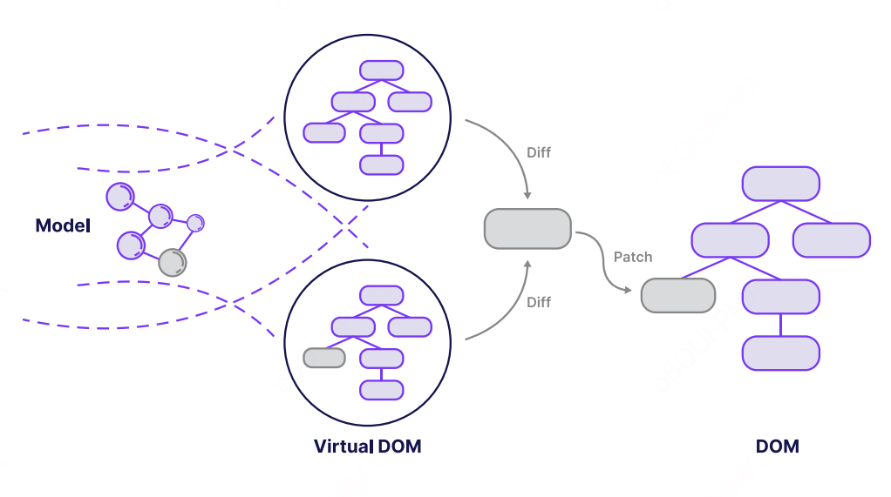

默认情况下，如果父组件重新渲染或传入的 props 发生变化，组件可能会重新渲染。这意味着即使组件的 props 未发生改变，其 render 方法有时仍然会运行。在大多数情况下，这是一种可以接受的权衡，因为比较两个对象（之前的 props 和当前的 props）可能会花费更多时间。

#### 对性能的负面影响、界面闪烁以及 FPS 的下降

虽然上述启发式规则在大多数情况下是正确的，但执行过多的操作可能会导致性能问题，尤其是在低端移动设备上。

因此，您可能会发现界面出现闪烁（更新发生时）或帧率下降（动画进行中同时发生更新）。

> 注意：过早进行优化可能会产生适得其反的效果。一旦在应用中发现掉帧或性能不佳的问题，应立即开始着手解决这些性能问题。

一旦您发现这些症状，就应该深入检查您的应用程序生命周期，寻找那些不必要的、意料之外的操作。

#### 我们如何知道该优化什么？

在进行性能优化时，我们希望基于数据做出决策。这些数据来源于使用专业工具测量性能的过程，这通常被称为性能分析（profiling）。有许多工具可以帮助我们对 React Native 应用进行性能分析，例如：[react-devtools](https://www.npmjs.com/package/react-devtools)、[why-did-you-render](https://legacy.reactjs.org/docs/profiler.html)、[Profiler](https://legacy.reactjs.org/docs/profiler.html) 等。

在本次练习中，我们将使用 Flipper，一个用于调试 iOS、Android 和 React Native 应用的平台。Flipper 集成了 React DevTools Profiler 作为插件，能够通过性能分析生成 React 渲染管道的火焰图（flame graph）。我们可以利用这些数据来分析应用程序中的重新渲染问题。下载 Flipper 后，选择 React DevTools：

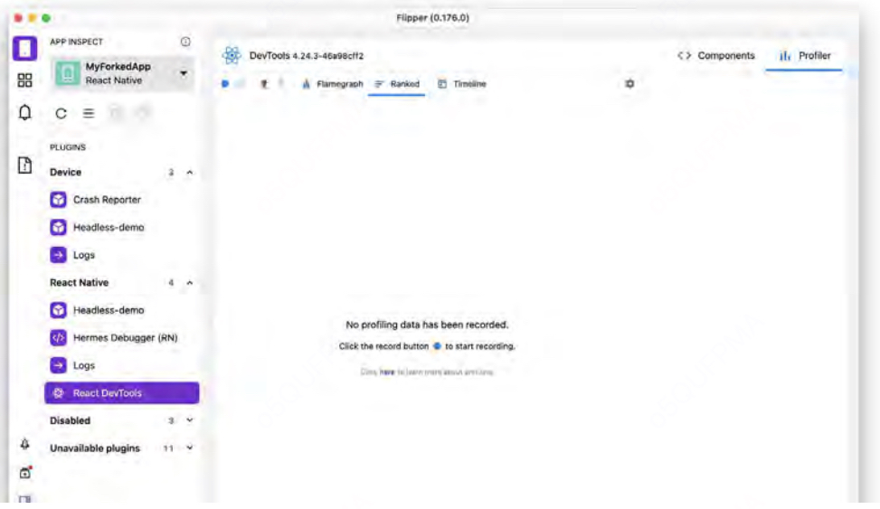

这是我们关于性能分析的代码

```js
import React, { useEffect, useState } from 'react';
import { View } from 'react-native';
const App = () => {
    const [value, setValue] = useState('');
    const backgroundStyle = {
        backgroundColor: '#fff',
        flex: 1,
        marginTop: 80,
    };
    useEffect(() => {
        setTimeout(() => {
            setValue('update 1');
        }, 3000);
        setTimeout(() => {
            setValue('update 2');
        }, 5000);
    }, []);
    return (
        <View style={backgroundStyle}>
            <ColoredView />
        </View>
    );
};
const ColoredView = () => {
    const style = { backgroundColor: 'red', padding: 10 };
    return <View style={style} />;
};
export default App;
```
在 Flipper 应用中，确保在设置图标中启用了“记录每个组件渲染的原因（Record why each component rendered while profiling）”选项，然后点击蓝色圆形按钮开始性能分析。大约 5 秒后，点击红色圆形按钮停止性能分析。您的性能分析结果可能类似于以下内容：


这个性能分析结果显示了某个组件渲染所花费的时间、渲染的次数以及导致渲染的原因。在我们的例子中，`ColoredView` 被渲染了两次，原因是其父组件被重新渲染。这可能提示我们，与 `ColoredView` 相关的代码存在意外的性能影响。基于这些信息，我们可以针对性地应用解决方案，以避免额外的重新渲染。

第一次查看性能火焰图可能会让人感到有些困惑。为了更深入地理解 React DevTools，可以观看 Ben Awad 的相关[视频](https://www.youtube.com/watch?v=00RoZflFE34&ab_channel=BenAwad)，他对这一工具有详细的讲解。此外，不要错过 React Native EU 上 Alex 的[演讲](https://www.react-native.eu/talks/alexandre-moureaux-performance-issues-the-usual-suspects)，该演讲详细说明了如何使用火焰图识别和解决问题。您还可以访问 React 官方网站，了解有关 [React Profiler](https://legacy.reactjs.org/blog/2018/09/10/introducing-the-react-profiler.html) 的详细信息。

### 解决方案：优化状态操作的次数，并在需要时使用记忆化组件（Memoized Components）。

应用程序可能会因为多种原因陷入不必要的渲染循环，这本身就是一个值得单独探讨的话题。在这里，我们将重点讨论两种常见场景——使用受控组件（如 TextInput）和全局状态。

#### 受控组件与非受控组件

让我们从第一个场景开始。几乎每个 React Native 应用都包含至少一个由组件状态控制的 TextInput，如下代码片段所示：

```javascript
import React, { useState } from 'react';
import { TextInput, StyleSheet } from 'react-native';
const UselessTextInput = () => {
    const [value, setValue] = useState('Text');
    const onChangeText = (text) => {
        setValue(text);
    };
    return (
        <TextInput
            accessibilityLabel=''Text input field''
            style={styles.textInput}
            onChangeText={onChangeText}
            value={value}
        />
    );
};
const styles = StyleSheet.create({
    textInput: {
    height: 40,
    borderColor: 'gray',
    borderWidth: 1,
    },
});
export default UselessTextInput;
```
> [代码出处](https://snack.expo.dev/@callstack-snack/textinput-example)

上述代码片段在大多数情况下都可以正常工作。然而，在性能较低的设备上，或者当用户输入速度非常快时，可能会导致视图更新出现问题。

这个问题是由 React Native 的异步特性引起的。为了更好地理解其中的原因，让我们首先看一下用户在输入并向 `<TextInput />` 中填入新字符时发生的标准操作顺序：

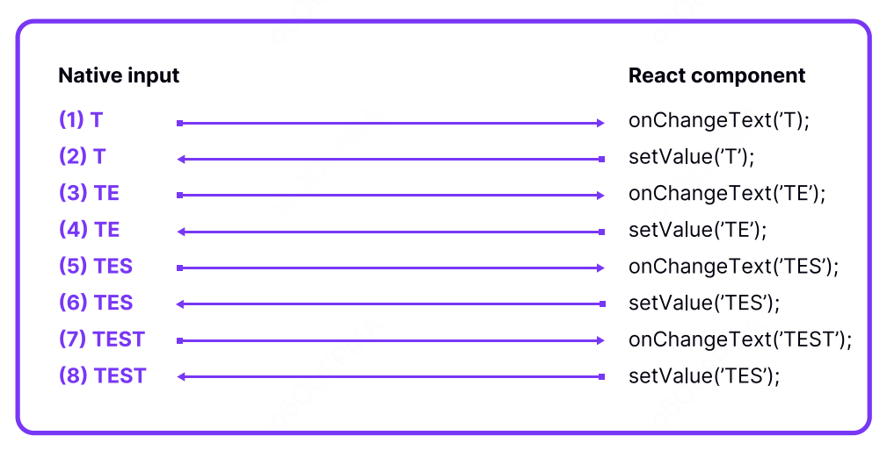

当用户开始在原生输入框中输入新字符时，会通过 onChangeText 属性向 React Native 发送一个更新（上述流程图中的操作 1）。React 处理该信息，并通过调用 setState 相应地更新其状态。接下来，受控组件会将其 JavaScript 的值与原生组件的值同步（上述流程图中的操作 2）。

这种方法有其优势。React 作为数据的唯一来源，控制了输入框的值。这种技术可以让您在用户输入时动态修改输入内容，例如进行验证、添加掩码，甚至完全更改输入内容。

不幸的是，上述方法虽然更加简洁且符合 React 的工作方式，但也存在一个缺点，尤其是在资源有限或用户输入速度非常快的情况下，这个问题会变得尤为明显。

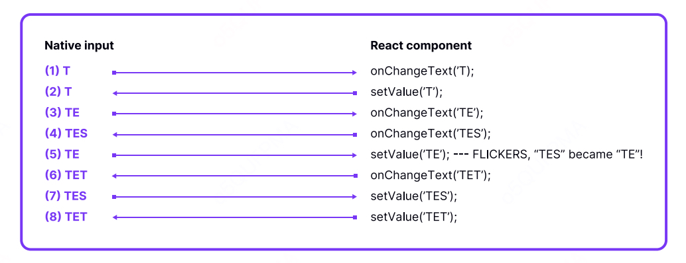

当通过 `onChangeText` 的更新在 React Native 将每次更新同步回界面之前到达时，界面会开始出现闪烁。用户输入 T 时，第一次更新（操作 1 和操作 2）可以顺利完成，没有问题。

接下来，操作 3 和操作 4 到达，用户在 React Native 忙于其他任务时输入了 E 和 S，导致字母 E 的同步（操作 5）被延迟。结果，原生输入框的值会暂时从 TES 恢复到 TE，出现短暂的回退现象。

此时，用户输入速度足够快，在输入框的值短暂回退为 TE 的瞬间又输入了另一个字符。结果，新的更新（操作 6）到达，输入框的值变成了 TET。这并非用户的本意——用户并未预料到输入框的值会从 TES 变回 TE。

最后，操作 7 将输入框的值同步回用户几次输入前的正确值（操作 4 传递的 TES）。不幸的是，这个值很快被另一次更新（操作 8）覆盖，将输入框的值同步为 TET，也就是最终的输入值。

问题的根本原因在于操作的执行顺序。如果操作 5 在操作 4 之前执行，事情就会顺利进行。此外，如果用户在输入框的值是 TE 而非 TES 时没有输入 T，界面可能会出现闪烁，但输入值仍将保持正确。

解决同步问题的一个方法是完全移除 TextInput 的 value 属性。这样，数据流将是单向的，仅从原生端流向 JavaScript 端，从而消除了之前描述的同步问题。

```javascript
import React, { useState } from 'react';
import { Text, TextInput, View, StyleSheet } from 'reactnative';

const PizzaTranslator = () => {
    const [value, setValue] = useState('');

    const onChangeText = (text) => {
        setValue(text);
    };

    return (
        <View style={styles.container}>
            <TextInput
                accessibilityLabel=''Text input field''
                placeholder=''Type here to translate!''
                onChangeText={onChangeText}
                defaultValue={value}
                style={styles.textInput}
            />
            <Text style={styles.label}>
            {value
            .split(' ')
            .map((word) => word && '🍕’)
            .join(' ')}
            </Text>
        </View>
    );
};

export default PizzaTranslator;

const styles = StyleSheet.create({
    container: {
    padding: 10,
    },
    textInput: {
        height: 40,    
    },
    label: {
        padding: 10,
        fontSize: 42,
    },
});
```
然而，正如 @nparashuram 在他的 YouTube 视频中提到的（这是学习 React Native 性能的优秀资源），[仅靠这种解决方法在某些情况下是不够的](https://www.youtube.com/watch?v=83ffAY-CmL4&t=1483s&ab_channel=InfiniteRed)。例如，在进行输入验证或添加掩码时，您仍然需要控制用户输入的数据，并更改最终显示在 TextInput 中的内容。

#### 全局状态

另一个常见的性能问题原因是组件与应用程序全局状态的依赖关系。最糟糕的情况是，像 TextInput 或 CheckBox 这样的单个控件的状态变化导致整个应用程序的重新渲染。这通常是由于糟糕的全局状态管理设计造成的。

首先，您的状态管理库应该能够确保只有在定义的特定数据子集发生更改时才更新组件——这时可以使用 useSelector 钩子（推荐使用它而不是 connect 函数，因为它更简单易用）。

其次，如果组件使用的数据与存储在状态中的数据形状不同，即使数据实际上没有发生改变，也可能触发重新渲染。为了避免这种情况，可以实现一个选择器（selector），在传递的依赖集合未变化时记忆派生结果。在 Redux Toolkit 中，可以使用 `createSelector` 创建记忆化选择器（memoized selector）。

```javascript
import { createSelector } from '@reduxjs/toolkit';

const selectVisibilityFilter = (state) => state.visibilityFilter;
const selectAllTodos = (state) => state.todos;
const selectVisibleTodos = createSelector(
  [selectVisibilityFilter, selectAllTodos],
  (filter, todos) => {
    switch (filter) {
      case 'SHOW_COMPLETED':
        return todos.filter((t) => t.completed);
      case 'SHOW_UNCOMPLETED':
        return todos.filter((t) => !t.completed);
      default:
        return todos;
    }
  }
);
```

一种常见的性能优化误区是认为可以用基于 React Context 的自定义实现替代状态管理库。起初，这种方法可能显得很方便，因为它减少了状态管理库带来的样板代码。但是，如果在没有正确实现记忆化的情况下使用它，会导致巨大的性能问题。最终，您可能会不得不将状态管理重构为 Redux，因为与为当前方案实现自定义选择器相比，使用 Redux 会更简单、更高效。

您还可以在单个组件级别优化应用程序。使用 React.memo 或 React.useMemo 可能会为您节省大量的重新渲染次数，而 React Profiler 可以精确地告诉您具体节省了多少次。尽量避免提前实现这些技术，因为这可能属于过早优化。在少数情况下，记忆化可能会因为增加内存使用而导致应用性能下降，这在 JavaScript 工具中是无法测量的。因此，始终确保对更改前后的性能进行分析，以确认这些更改确实使应用程序运行得更快。

#### 状态规范化（Redux Toolkit）：

在应用开发中，经常需要处理实体（entities），即数据集合，其中每条记录都有一个特定字段的唯一 ID，例如 User、Post、Todo、Comment。状态规范化 是一种推荐的方法，用于在 Redux 存储中以标准化和有组织的方式管理实体。这种方法对 CRUD（创建、读取、更新、删除）操作提供了极大帮助，同时保持了高性能。其核心思想是将存储的一部分视为数据库，并以规范化的形式存储这些数据。

想象一下，您的桌上有一堆重要的文件。如果您花时间将这些文件分类整理，放入文件夹中，并给每个文件夹贴上一个唯一的 ID 标签，同时记录这些文件夹在书架上的排序列表，那么以后查找所需文件会变得更加快捷。这种方法比每次都在一堆未整理的文件中翻找要高效得多，虽然前期需要花费一些时间进行准备。

类似地，我们可以对一组博客文章进行组织管理——需要将数组转换为一个以 ID 为键的实体映射记录（对应带有 ID 的文件夹），以及一个用于指示顺序的 ID 数组（对应书架上的文件夹列表）。

以下是标准化存储数据的示例：
```javascript
const blogPosts = {
  posts: {
    byId: {
      post1: {
        id: 'post1',
        author: 'user1',
        body: '......',
        comments: ['comment1', 'comment2'],
      },
      post2: {
        id: 'post2',
        author: 'user2',
        body: '......',
        comments: ['comment3', 'comment4'],
      },
    },
    allIds: ['post1', 'post2'],
  },
  comments: {
    byId: {
      comment1: {
        id: 'comment1',
        author: 'user2',
        comment: '.....',
      },
      comment2: {
        id: 'comment2',
        author: 'user3',
        comment: '.....',
      },
    },
    allIds: ['comment1', 'comment2'],
  },
};
```
由于可以通过 ID 快速访问每个实体，我们拥有了一种高效的方法来管理大量数据。不仅选择操作快速，添加、插入更新（upsert）、更新以及删除操作也同样高效。

在 Redux Toolkit 中，提供了 `createEntityAdapter` 方法，可以自动处理这种机制，并返回一组专用工具，包括 CRUD 函数、选择器（selectors）和排序辅助工具（sorting helpers）。

```javascript
import {
 createEntityAdapter,
 createSlice,
PayloadAction,
 nanoid,
} from ''@reduxjs/toolkit'';
import { RootState } from ''../../store'';
export interface Todo {
 id: string;
 name: string;
 completed: boolean;
}
const todoEntity = createEntityAdapter<Todo>();
export const todoSlice = createSlice({
 name: ''todo'',
 initialState: todoEntity.getInitialState(),
 reducers: {
 addTodo(state, { payload: { name } }: PayloadAction<{
name: string }>) {
 todoEntity.addOne(state, {
 name,
 id: nanoid(),
 completed: false,
 });
 },
 removeTodo(state, { payload }: PayloadAction<string>) {
 todoEntity.removeOne(state, payload);
 },
 updateValue(state, action: PayloadAction<Todo>) {
 todoEntity.upsertOne(state, action);
 },
 updateBy(state, { payload: { id } }: PayloadAction<{ id:
string }>) {
const previousValue = state.entities[id]?.completed;
if (typeof previousValue === ''boolean'') {
 todoEntity.updateOne(state, {
 id,
 changes: { completed: !previousValue },
 });
 }
 },
 },
});
export const todoActions = todoSlice.actions;
export type TodoSlice = {
 [todoSlice.name]: ReturnType<(typeof todoSlice)[''reducer'']>;
};
const globalizedTodoSelector = (state: RootState) => state[todoSlice.name];
const entitySelectors = todoEntity.getSelectors<RootState>((state) =>
 globalizedTodoSelector(state),
);
export const todoSelectors = {
 ...entitySelectors,
};
```
实体适配器（entity adapter）的主要内容是用于处理实体状态对象的增删改操作的一组生成的 reducer 函数，包括以下功能：

```javascript
const todoEntity = createEntityAdapter<Todo>()
```
实体适配器包含一个 getSelectors() 函数，该函数返回一组选择器，这些选择器可以读取实体状态对象的内容。以下是这些选择器的详细说明：

```javascript
const entitySelectors = todoEntity.
getSelectors<RootState>((state) =>
state[todoSlice.name])
```

#### 原子状态（Atomic State）

Redux 最初推广单一存储（单一数据流，自上而下的思维模型）模式。然而，随着应用程序变得更加复杂，这种方法变得笨重。现在，状态管理的趋势正在转向更为分散、原子化的设计。

为什么不再倾向于单一存储？
- 对于某些应用来说，它可能显得过于复杂。
- 代码过于冗长。
- 需要使用大量记忆化技术来避免重新渲染。
- 自上而下的模式虽然直观，但性能较差。
- 当应用程序规模扩大时，更多的状态需要管理，同时还需要处理局部 UI 状态（例如加载状态、错误信息、提示消息等）。

如果不留意 Redux 存储，它可能会吸收所有的状态，从而形成难以维护的“巨石式”结构。自上而下的设计会将大多数状态集中在顶层组件中，这导致父组件的状态更新可能会引发其所有子组件的重新渲染。

理想情况下，状态应尽可能本地化到组件中，以便更灵活地复用。这意味着我们应该从底部向上构建（bottom-up），而不是自上而下构建（top-down）。

考虑一个待办事项列表（TODO List），它有一些筛选器选项，比如“显示全部”、“只显示活动项”或“只显示已完成项”。我们会识别出顶级组件 TodoList，但不会从这里开始设计。相反，我们会先识别出它的子组件，从构建较小的组件开始，逐步组合成更复杂的元素。

我们需要在一个组件中显示数据，而这些数据由另一个组件管理。为了避免使用父状态并向下传递数据和操作（自上而下的方法），我们可以使用一个状态管理工具来存储数据，使其可访问，并提供操作方法。

**Zustand**

[Zustand](https://github.com/pmndrs/zustand) 通常被用作一种自上而下的模式，但由于它的简单性和非约束性（unopinionated），我们也可以利用它以自下而上的方式构建组件。

**Store**

我们创建一个对象，用于存放过滤器（filter）以及暴露的修饰符（modifiers），以便在应用中管理和使用它们。

```javascript
export const useHomeStore = create((set) => ({
    filter: filterType.all,
    showAll: () => set({ filter: filterType.all }),
    showOnlyCompleted: () => set({ filter: filterType.completed }),
    showOnlyActive: () => set({ filter: filterType.active }),
}));
```

**Show all filter button**
以下是更新特定项目（例如票据）以避免其子组件重新渲染的示例实现
```javascript
const ShowAllItem = () => {
 const showAll = useHomeStore((state) => state.showAll);
 return <Menu.Item onPress={showAll} title=''Show All'' />;
};
```

**Todo item**
以下是一个过滤功能示例，TodoItemList 组件仅在过滤条件更改时重新渲染，而不会因无关状态变化而导致不必要的重新渲染：

```javascript
export const TodoItemList = ({ item }) => {
    const filter = useHomeStore((state) => state.filter);
    if (!shouldBeShown(filter, item.done)) {
        return null;
    }
    return (
        <View>
            <Text>{item.title}</Text>
            <Text>{item.description}</Text>
        </View>
    );
};
```

**Jotai**

Jotai 是专为自下而上的状态管理方法设计的，其语法简洁明了。Jotai 基于 atom 的概念，将每个 atom 视为一个独立的“存储单元”。开发者可以使用不同的 Hook，使 atom 的状态变为只读或可变，从而实现灵活的状态管理。

**Store**
我们使用 `useAtomValue` 来读取过滤器的值，使用 `useSetAtom` 来设置新值。这在性能是一个关注点时尤其有用。

```javascript
const filter = atom(filterType.all);

export const useCurrentFilter = () => useAtomValue(filter);
export const useUpdateFilter = () => useSetAtom(filter);
```

**FilterMenuItem**
```javascript
const FilterMenuItem = ({ title, filterType }) => {
    const setUpdateFilter = useUpdateFilter();
    const handleShowAll = () => setUpdateFilter(filterType);
    return <Menu.Item onPress={handleShowAll} title={title} />;
};
```

**TodoItem**
```javascript
export const TodoItemList = ({ item }) => {
    const filter = useCurrentFilter();
    if (!shouldBeShown(filter, item.done)) {
        return null;
    }
    return (
        <View>
            <Text>{item.title}</Text>
            <Text>{item.description}</Text>
        </View>
    );
};
```

通过这种自下而上的方法，我们可以防止父组件的状态变化，并避免对子组件的重新渲染。此外，这种方法通常还能减少对记忆化的过度使用。

#### 未来：React Forget

手动内存管理对大多数开发者来说并不有趣——无论是通过 C 语言手动释放内存，还是在 React 中手动对组件和值进行记忆化。我们通常会选择使用更高级的语言或智能编译器来替我们处理这些繁琐的任务。

React Forget 是 React 的一种“自动记忆化编译器”，旨在提升组件的重新渲染性能，甚至可能完全消除使用 memo()、useCallback() 和 useMemo() 的需求。这个编译器不仅能够对 useMemo() 的结果进行记忆化处理，还能对组件返回的 React 元素对象进行记忆化优化。

React Forget 的名称来源于其设计理念：该工具会自动处理组件级别的优化和记忆化任务，从而让开发者可以“忘记”这些手动优化带来的负担和额外的样板代码。通过这种方式，开发者可以更专注于核心业务逻辑，而不用担心性能优化的细节问题。

**注意： 值得一提的是，截至撰写本章节时，React Forget 仍处于开发阶段，尚未向公众正式发布。**
**在 React Conf 2021 大会上，@Huxpro 提供了一段精彩的视频，详细描述了 React Forget 的底层工作原理。到了 2023 年，我们从 React Advanced 2023 大会上获得了来自 Meta 的 Joe Savona 和 Mofei Zhang 的最新消息，他们分享了 React Forget 在 Instagram 网站上的开发与实验进展情况。**

让我们回顾上一章关于原子状态的待办事项列表应用示例代码，并看看如何用未来的 React Forget 编译器对其进行简化。

在这个示例中，我们有一个 TodoListItem 组件，希望将其用于 TodoList 组件中。为了避免在添加待办事项、更改可见性或主题设置时发生多次不必要的重新渲染，我们通常需要用 React.memo 包裹它。

此外，我们还需要关注组件内部的所有函数，例如 handleChange，这些函数在每次渲染时都会被重新创建。需要记忆化和手动处理的内容相当多，这种重复操作很容易让人感到烦躁。

```javascript
const MemoizedTodo = React.memo(TodoListItem);

const TodoList = ({ visibility, themeSettings }) => {
    const [todos, setTodos] = useState(initialTodos);

    const handleChange = useCallback((todo) => {
        setTodos((todos) => getUpdated(todos, todo));
    }, []);

    const doneTodosNumber = useMemo(getDoneTodos(todos, visibility),[]));

    return (
        <View>
            <FlatList data={todos} renderItem={MemoizedTodo} />
            <Text>Done: {doneTodosNumber}</Text>
            <TouchableOpacity onPress={handleChange}>
            <Text>Change</Text>
            </TouchableOpacity>
        </View>
    );
};
```
React Forget 的目标是彻底解决这个问题。其承诺是，上述示例代码可以简化为如下形式：

```javascript
const TodoList = ({ visibility, themeSettings }) => {
    const [todos, setTodos] = useState(initialTodos);
    const handleChange = setTodos((todos) => getUpdated(todos, todo));
    const doneTodosNumber = getDoneTodos(todos, visibility);
    return (
        <View>
        <FlatList data={todos} renderItem={TodoListItem} />
        <Text>Done: {doneTodosNumber}</Text>
        <TouchableOpacity onPress={handleChange}>
        <Text>Change</Text>
        </TouchableOpacity>
        </View>
    );
};
```
并且，它的行为将与之前手动记忆化的示例完全相同。

不再需要使用 useCallback 或 React.memo，代码将由编译器自动优化。这种方式简洁高效，非常令人满意。

作为本书的作者，我们对 React Forget 感到非常期待，迫不及待地希望它能够正式发布。届时，我们可能会将大部分与手动记忆化管理相关的内容移除。

### 优势：更少的资源消耗和更快的应用性能

你应该始终将应用性能放在心上，但也要警惕过早优化。有人说“过早优化是万恶之源”，这话并不完全正确，但也不是完全错误。过早的记忆化可能会导致更多的内存占用，而实际带来的性能提升却微乎其微，与投入的精力不成比例。这就是为什么衡量并识别具有显著影响的问题至关重要。

大多数难以解决的性能问题都源于状态管理方面的不良架构决策。不同的库在权衡取舍上各有特点。确保你和你的团队理解这些权衡，并选择最适合你们工作方式的工具。

对于一些人来说，可能更习惯 Redux 的详细操作，而另一些人可能更喜欢 Zustand 的简洁易用，因为它能避免额外重新渲染的复杂性。

综合考虑这些因素，你的应用应该能够减少不必要的操作，消耗更少的资源来完成任务。这不仅可以降低电池消耗，还能让用户在与界面交互时获得更高的满意度。

## 第二节 为特定布局使用专用组件
> 了解如何使用专用的高阶 React Native 组件提升用户体验和应用性能
### 问题：您不了解 React Native 提供的高阶组件。
在 React Native 应用中，一切都是组件。在组件层级的末端，有一些所谓的原生组件（primitive components），例如 Text、View 或 TextInput。这些组件由 React Native 实现，并由目标平台提供，用于支持最基本的用户交互。

当我们构建应用时，会将其由较小的构建块组成。为此，我们会使用原生组件。例如，要创建一个登录界面，我们可以使用一系列 TextInput 组件来注册用户信息，并使用一个 Touchable 组件来处理用户交互。从我们在应用中创建的第一个组件开始，这种方法贯穿应用开发的始终，直到开发的最终阶段。

除了原生组件之外，React Native 还提供了一组高阶组件，这些组件经过设计和优化，用于特定的目的。如果不了解或未使用这些高阶组件，可能会影响应用的性能，尤其是在您的状态中填充了实际生产数据时。应用性能差可能会严重损害用户体验，从而导致用户对产品不满意，并转向您的竞争对手。

#### 未使用专用组件会随着数据增长影响应用的性能和用户体验。

如果您未使用专用组件，就放弃了性能改进的机会，并可能在应用投入生产时面临用户体验下降的风险。需要注意的是，某些问题在开发过程中可能无法察觉，因为模拟数据通常较小，无法反映生产数据库的规模。专用组件更全面，拥有更广泛的 API，能够覆盖大多数移动场景的需求。

### 解决方案：始终使用专用组件，例如列表使用 FlatList。

让我们以长列表为例。几乎每个应用程序都会在某些时候包含一个列表。创建元素列表最快速且最简单的方法是结合使用 ScrollView 和 View 这类原生组件。

然而，当数据量增长时，这种方法会很快变得问题重重。处理大规模数据集、实现无限滚动以及进行内存管理，正是 React Native 提供 FlatList 这一专用组件的初衷，FlatList 专为显示和操作此类数据结构而设计。

对比基于 ScrollView 添加新列表元素的性能：
```javascript
import React, { useCallback, useState } from 'react';
import { ScrollView, View, Text, Button, StyleSheet } from 'react-native';

const objects = [
    ['avocado', '🥑'],
    ['apple', '🍏'],
    ['orange', '🍊'],
    ['cactus', '🌵'],
    ['eggplant', '🍆'],
    ['strawberry', '🍓'],
    ['coconut', '🥥'],
];

const getRandomItem = () => {
    const item = objects[~~(Math.random() * objects.length)];
    return {
        name: item[0],
        icon: item[1],
        id: Date.now() + Math.random(),
    };
};

const _items = Array.from(new Array(5000)).map(getRandomItem);

const List = () => {
    const [items, setItems] = useState(_items);
    const addItem = useCallback(() => {
        setItems([getRandomItem()].concat(items));
     }, [items]);
    return (
        <View style={styles.container}>
            <Button title=''add item'' onPress={addItem} />
            <ScrollView>
                {items.map(({ name, icon, id }) => (
                    <View style={styles.itemContainer} key={id}>
                        <Text style={styles.name}>{name}</Text>
                        <Text style={styles.icon}>{icon}</Text>
                    </View>
                ))}
            </ScrollView>
        </View>
    );
};
const styles = StyleSheet.create({
    container: {
        marginTop: 30,
    },
    itemContainer: {
        borderWidth: 1,
        margin: 3,
        padding: 5,
        flexDirection: 'row',
    },
    name: {
        fontSize: 20,
        width: 150,
    },
    icon: {
        fontSize: 20,
    },
});
export default List;
```
换成`FlatList`。
```javascript
import React' { useCallback' useState } from 'react';
import { View' Text' Button' FlatList' StyleSheet } from 'react-native';

const objects = [
    'avocado 🥑',
    'apple 🍏',
    'orage 🍊',
    'cactus 🌵',
    'eggplant 🍆',
    'strawberry 🍓',
    'coconut 🥥',
];

const getRandomItem = () => {
    const item = objects[~~(Math.random() * objects.length)].split(' ');
    return {
        name: item[0],
        icon: item[1],
        id: Date.now() + Math.random(),
    };
};

const _items = Array.from(new Array(5000)).map(getRandomItem);
const List = () => {
    const [items, setItems] = useState(_items);

    const addItem = useCallback(() => {
        setItems([getRandomItem()].concat(items));
    }, [items]);

    const keyExtractor = useCallback(({ id }) => id.toString(), []);
    
    const renderItem = useCallback(({ item: { name, icon } }) => (
            <View style={styles.itemContainer}>
                <Text style={styles.name}>{name}</Text>
                <Text style={styles.icon}>{icon}</Text>
            </View>
        ),
        [],
    );
    return (
        <View style={styles.container}>
            <Button title=''add item'' onPress={addItem} />
            <FlatList
            data={items}
            keyExtractor={keyExtractor}
            renderItem={renderItem}
            />
        </View>
    );
};

const styles = StyleSheet.create({
    container: {
        marginTop: 30,
    },
    itemContainer: {
        borderWidth: 1,
        margin: 3,
        padding: 5,
        flexDirection: 'row',
    },
    name: {
        fontSize: 20,
        width: 150,
    },
    icon: {
        fontSize: 20,
    },
});
export default List;
```

差异非常显著，不是吗？在一个包含 5000 个列表项的示例中，使用 ScrollView 的版本甚至无法流畅滚动。

最终，FlatList 也会使用 ScrollView 和 View 组件。那么，关键区别是什么呢？

关键在于 FlatList 内部抽象的逻辑。它包含了许多启发式算法和高级 JavaScript 计算，用于减少屏幕显示数据时发生的不必要渲染，并确保滚动体验始终以 60FPS 的速度运行。然而，仅仅使用 FlatList 在某些情况下可能还不够。

FlatList 的性能优化依赖于不渲染屏幕上不可见的元素。然而，这个过程中最耗费资源的部分是 布局测量。FlatList 需要测量您的布局，以确定滚动区域中应该为即将加载的元素预留多少空间。

对于复杂的列表元素，这可能会显著减慢与 FlatList 的交互。每次 FlatList 需要渲染下一批数据时，都必须等待所有新项渲染完成后再测量它们的高度。

为了解决这个问题，可以实现 getItemHeight() 方法，提前定义元素的高度，而无需进行测量。但对于高度不固定的元素，这并不简单。可以根据文本行数和其他布局约束计算出高度值。

我们建议使用 react-native-text-size 库来一次性计算所有列表项中显示文本的高度。在我们的案例中，这显著提升了 Android 平台 上 FlatList 滚动事件的响应速度。

#### FlashList：FlatList 的继任者
如前所述，与 ScrollView 相比，FlatList 在处理大列表时显著提高了性能。尽管 FlatList 已被证明是一个高性能的解决方案，但它也存在一些问题。

开发者和用户经常会遇到一些常见问题，例如滚动时出现空白区域、滚动卡顿，以及列表响应不够迅速。这些问题几乎每天都会发生。FlatList 的设计会在内存中保留某些元素，这增加了设备的开销，最终导致列表变慢。而空白区域的出现则是因为 FlatList 未能足够快地渲染列表项。

尽管我们可以通过一些技巧在一定程度上减轻这些问题，但在大多数情况下，我们仍然希望列表更加流畅和快速响应。使用 FlatList 时，JS 线程大部分时间都在忙碌，我们也总是希望在滚动列表时，JS 线程能够保持 60FPS 的表现。

那么，我们应该如何应对这些问题呢？如果不用 FlatList，那么该选择什么呢？幸运的是，Shopify 开发了一种优秀的 FlatList 替代方案，名为 FlashList。

FlashList 会回收视口外的视图，并将其重新用于其他列表项。如果列表包含不同类型的项，FlashList 会使用回收池，根据类型来复用列表项。这种机制要求列表项尽量保持轻量化，并避免任何副作用，否则会影响列表的性能。

关键属性
- estimatedItemSize
  - 这是列表项的近似大小，用于帮助 FlashList 决定初始加载和滚动时需要渲染的列表项数量。
  - 如果列表项大小不同，可以对其大小取平均值。
  - 如果在初次渲染时未提供该值，FlashList 会通过警告提示获取建议值，之后可以将其用于后续渲染。
  - 另一种方法是使用 React Native 应用中的开发工具（元素检查器）来获取该值。
- overrideItemLayout
  - 此属性优先于 estimatedItemSize。
  - 如果列表项大小不同且已知具体大小，建议使用该属性直接提供值，而不是采用平均值。

测量 FlashList 性能时，请确保 提前打开 JS 包的发布模式。在开发模式下，FlashList 可能看起来比 FlatList 慢，其主要原因是开发模式中 windowSize 非常小且固定。

您可以利用 FlashList 内置的回调函数来测量性能：
- onBlankArea：检测列表滚动时出现的空白区域。
- onLoad：测量列表加载时间。

更多可用的辅助工具可以参考文档中的 Metrics 部分，了解如何优化和分析列表性能。

我们还可以使用 BamLab 的 Flashlight 工具，它可以在发布版本中生成 FPS 的性能报告。同时，它还能绘制出一段时间内的 CPU 使用图表，让我们能够验证特定操作对该指标的影响。

目前，Flashlight 仅支持 Android，但开发团队正在努力实现对 iOS 的支持。

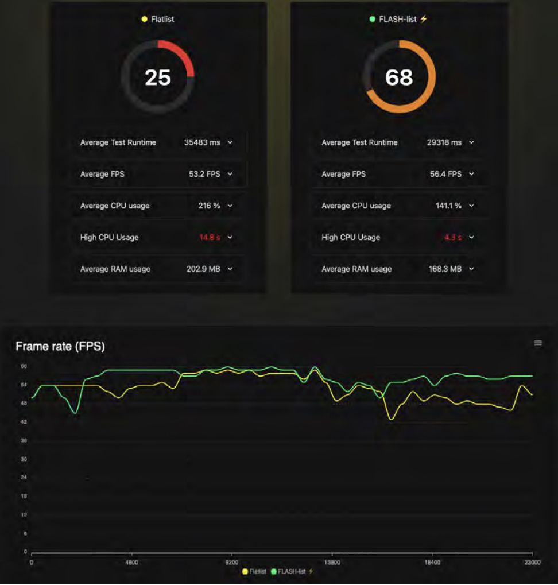

使用 Flashlight 无需在应用中安装任何内容，使得该工具更加易于使用。它还可以测量生产环境应用的性能，并生成非常美观的网页报告，这些报告包括以下内容：
- 总 CPU 使用率
- 每个线程的 CPU 使用率
- RAM 利用率

使用 Flashlight 有两种方式：您可以在本地运行：
- `• curl https://get.flashlight.dev | bash `
- 或者通过 flashlight.dev 在云端运行。

通过使用专用组件，您的应用程序将始终以最快的速度运行。您可以自动利用 React Native 提供的所有性能优化，并订阅未来的更新。同时，您还节省了大量从头重新实现常见 UI 模式的时间，比如粘性分段标题和下拉刷新等功能。如果您选择使用 FlashList，这些功能已默认支持。

## 第三节 在选择外部库之前请三思而后行。
> 使用正确的 JavaScript 库可以帮助您提升应用的速度和性能。

### 问题：您在未检查库内容的情况下选择了库。

JavaScript 开发就像是用小型模块搭建应用程序，在某种程度上，这与构建 React Native 应用非常相似。与其从头创建 React 组件，开发者通常会寻找能够帮助实现目标的 JavaScript 库。JavaScript 生态系统提倡这种开发方式，并鼓励围绕小而可重用的模块来构建应用程序。

这种生态系统具有许多优势，但也存在一些严重的缺陷。其中之一是开发者在面对支持相同功能的多个库时，往往难以选择。在为下一个项目选择库时，他们通常会研究一些指标，比如 GitHub 星标数、问题数量、贡献者数量以及 PR 活跃度，以判断库是否健康且维护良好。

然而，他们往往忽略了库的大小、支持的功能数量以及外部依赖。开发者假设，既然 React Native 是基于 JavaScript 并拥抱现有工具链的，他们可以按照开发 Web 应用的约束和最佳实践进行操作。

事实上，这种假设并不成立，因为移动开发与 Web 开发本质上是不同的，并且有自己的一套规则。例如，在 Web 应用中，资源文件的大小至关重要，而在 React Native 中，资源文件存储在文件系统中，其重要性并不相同。

关键区别在于移动设备的性能以及用于打包和编译应用程序的工具。虽然设备性能限制是无法直接改变的，但您可以控制自己的 JavaScript 代码。一般来说，代码越少，启动时间就越快。而影响代码整体大小的最重要因素之一就是所选的库。

#### 复杂的库会削弱应用程序的速度

与完全原生的应用程序不同，React Native 应用包含一个需要加载到内存中的 JavaScript 包。随后，这些代码会被 JavaScript 虚拟机解析和执行。因此，JavaScript 代码的总体大小是一个重要因素。


在此过程中，应用会保持在加载状态。我们通常将这一过程称为 TTI（Time to Interactive），即从点击应用图标到应用完全可交互之间的时间，通常以毫秒为单位衡量（希望尽量短）。

不幸的是，默认的 React Native 打包工具 Metro 目前不支持 Tree Shaking（树摇优化）。如果您对这一概念不熟悉，可以阅读相关文章进行了解。

这意味着，从 NPM 拉取并导入到项目中的所有代码都会包含在生产环境的 JavaScript 包中，加载到内存并被解析。这可能会对应用的总启动时间产生负面影响。

值得注意的是，使用 Hermes 引擎 时情况有所不同，它会自动将所需的字节码分页加载到内存中。有关更多信息，请参阅 Hermes 章节。

#### 如何分析包的大小

密切关注包的大小非常重要。我们可以使用 react-native-bundle-visualizer 通过 GUI 来分析包的内容。通过该工具，我们可以详细了解包中添加的任何库，从而决定是否值得保留或移除该库。该工具会根据应用包生成如下形式的输出：

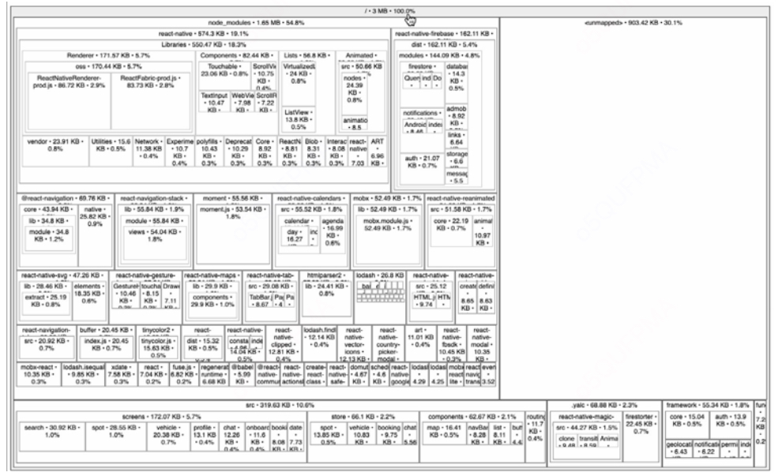

### 解决方案：更加精挑细选，使用更小型、更专用的库。

解决这一问题的最简单方法是从一开始就为项目设计合适的架构策略。

如果您打算引入一个复杂的库，请先检查是否有更小的替代库可以满足您的需求。

例如：日期操作是最常见的操作之一。假设您需要计算时间的差值，与其引入整个 `moment.js` 库（67.9 KB）来解析日期，不如选择更轻量的替代方案。

```javascript
import moment from 'moment';

const date = moment('12-25-1995', 'MM-DD-YYYY');
```
我们可以使用 day.js（仅 2KB），它体积更小，仅提供我们需要的功能。

```javascript
import dayjs from 'dayjs';

const date = dayjs('12-25-1995', 'MM-DD-YYYY');
```
如果没有替代库，一个好的经验法则是检查是否可以只导入库的一部分。

例如，许多库（如 lodash）已经拆分成更小的工具集，并支持无法进行死代码消除的环境。

假设您需要使用 lodash 的 map 方法，与其导入整个库（如下所示）：
```javascript
import { map } from 'lodash';

const square = (x) => x * x;
map([4, 8], square);
```
您可以仅导入单个模块包：
```javascript
import map from 'lodash/map';

const square = (x) => x * x;
map([4, 8], square);
```
这样，您可以享受到 lodash 包中的特定工具，而无需将整个库加载到应用程序的包中。

如果您希望随时了解依赖项对包大小的影响，我们强烈推荐使用 import-cost 的 VSCode 插件，或者访问 Bundlephobia 网站进行检查。

### 优势：您的应用占用更小，加载速度更快。

移动端是一个竞争异常激烈的环境，众多应用都旨在实现类似的功能，并争夺同样的用户群体。更快的启动时间、更流畅的交互以及整体的视觉和操作体验，可能是您脱颖而出的唯一途径。

您不应低估选择合适库的重要性。对第三方依赖的选择更为谨慎，起初可能看似无关紧要。但所有节省下来的毫秒时间，随着时间的推移，将累计成为显著的优势。

## 第四节 始终记得使用专为移动平台设计的库。

> 使用专为移动平台设计的库，可同时在多个平台上更快地构建功能，同时不影响性能和用户体验。

### 问题：您使用了未针对移动端优化的 Web 库。
如前所述，React Native 的最大优势之一是您可以使用 JavaScript 编写移动应用，重用部分 React 组件，并结合您喜爱的状态管理库处理业务逻辑。

尽管 React Native 提供了类似 Web 的功能以实现与 Web 的兼容性，但重要的是要理解它并不是完全相同的运行环境。React Native 有自己的一套最佳实践、快速优化方式和约束条件。

例如，在开发 Web 应用时，我们通常无需过多担心应用对 CPU 资源的整体需求。毕竟，大多数网站都运行在连接电源或配备大容量电池的设备上。

然而，移动端的情况则完全不同。移动设备的种类繁多，架构和可用资源各异。大多数情况下，这些设备依赖电池运行，而应用程序的耗电量通常是开发者需要重点考虑的因素之一。

换句话说——优化前台和后台的电池消耗方式，可能会对应用的性能和用户体验产生决定性的影响。

#### 未优化的库会导致电池消耗加剧并减慢应用速度，操作系统可能会限制您的应用功能。

虽然 React Native 允许在移动端运行与浏览器中相同的 JavaScript，但这并不意味着您应该每次都这样做。和任何规则一样，总有例外。

如果库严重依赖网络（如实时消息传递）或需要渲染高级图形（如 3D 结构、图表），通常更适合选择专为移动端设计的库。

移动端库最初在 Web 环境中开发，假设了浏览器的能力和限制。如果使用流行 SDK 的 Web 版本，很可能会导致额外的 CPU 和内存消耗。

某些操作系统（如 iOS）以不断分析应用资源消耗而闻名，其目的是优化电池寿命。如果您的应用注册了后台活动，但这些活动消耗了过多资源，操作系统可能会调整应用的后台运行间隔，从而降低您最初期望的后台更新频率。

### 解决方案：使用专门为特定平台设计的库版本。

以 Firebase 为例，Firebase 是谷歌提供的一个移动平台，可以帮助您更快速地构建应用。它是由一系列工具和库组成的，能够在您的应用中即时启用某些功能。

Firebase 提供了适用于 Web 和移动端（分别是 iOS 和 Android）的 SDK。每个 SDK 都支持 Realtime Database（实时数据库）。

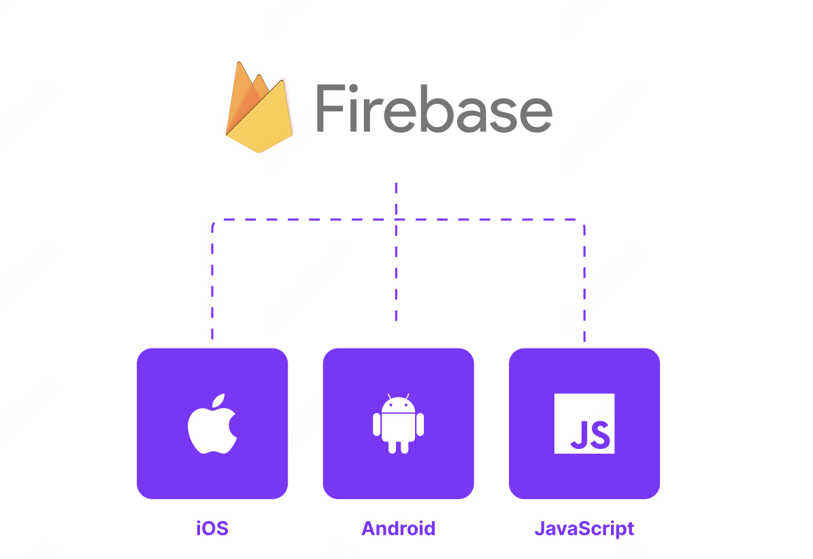

得益于 React Native，您可以运行其 Web 版本，并且不会遇到大的问题：

```javascript
import { getDatabase, onValue, ref } from firebasedatabase;

const database = getDatabase();

onValue(ref(database, users123), (snapshot) => {
    console.log(snapshot.val());
})
```
然而，这并不是您应该选择的做法。虽然上述示例可以正常运行，但其性能并不如移动端版本。此外，Web 版本的 SDK 所包含的功能也更少——这并不意外，因为 Web 环境与移动端不同，因此 Firebase.js 不会支持移动端的专用功能。

在这种情况下，使用专用的 Firebase 库是更好的选择。这些库在原生 SDK 的基础上提供了一层轻量封装，能够实现与其他原生应用相同的性能和稳定性。


以下是上述示例的实现方式：
```javascript
import database from '@react-native-firebasedatabase';

database().ref('users123').on('value', (snapshot) => {
    console.log(snapshot.val());
});
```
如您所见，差异非常小。在这种情况下，库的作者在模仿 API 方面做得非常出色，从而减少了在 Web 和移动端环境之间切换时可能产生的困惑。

### 优势：提供最快速、性能最佳的支持，同时不损害电池寿命。
React Native 的核心理念是为您提供构建应用的控制权和自由度。

对于简单的需求和最大化的代码复用，您可以选择使用库的 Web 版本。这种方式能够以较低的开发成本访问与浏览器中相同的功能。

对于更复杂的用例，您可以轻松地通过原生功能扩展 React Native，并直接与移动端 SDK 交互。这种“逃生舱口”正是 React Native 变得高度灵活且适合企业级应用的原因。

它让您能够同时在多个平台上更快速地构建功能，而不影响性能和用户体验——这是其他混合框架无法企及的。

## 第五节 在原生与 JavaScript 之间找到平衡点。

> 在原生与 JavaScript 之间寻求和谐，以构建高效运行且维护成本低的应用。

### 问题：在开发原生模块时，您在原生与 JavaScript 抽象之间划分的界限不当。

在使用 React Native 时，您大部分时间会编写 JavaScript。但是，在某些情况下，您需要编写一些原生代码。例如，当您使用的第三方 SDK 尚未提供官方的 React Native 支持时，您需要创建一个原生模块，将底层原生方法封装并导出到 React Native 环境中。

所有原生方法都需要实际的参数来运行。React Native 基于一种名为 桥（bridge） 的抽象层构建，该桥提供了 JavaScript 和原生世界之间的双向通信。

***注意：目前正在努力将异步桥接通信转向同步通信。您可以在 New Architecture（新架构） 章节中了解更多相关内容。***

因此，JavaScript 可以执行原生 API，并传递必要的上下文以接收期望的返回值。这种通信本身是异步的——也就是说，当调用方在等待来自原生端的结果时，JavaScript 仍然在运行，并可能已经开始处理其他任务。

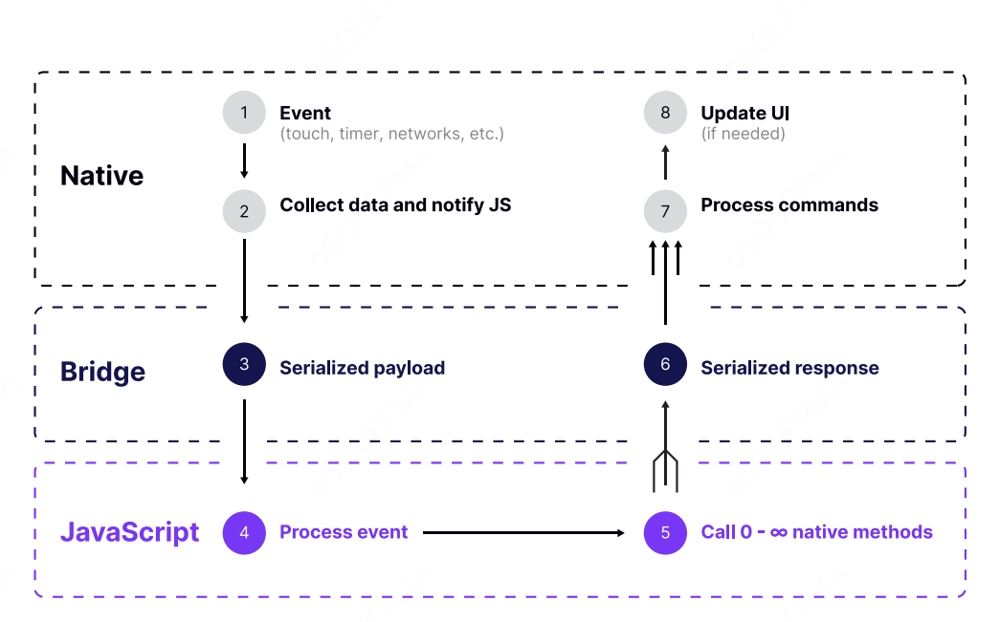

通过桥接传递的 JavaScript 调用数量并不是确定的，会随着应用中的交互数量而变化。此外，每次调用都需要时间，因为 JavaScript 的参数需要被序列化为 JSON 格式，这是两端可以理解的通用格式。

例如，当桥接正忙于处理数据时，另一个调用可能会被阻塞并需要等待。如果该交互与手势或动画相关，很可能会出现丢帧的情况——操作未能及时完成，从而导致用户界面出现卡顿现象。

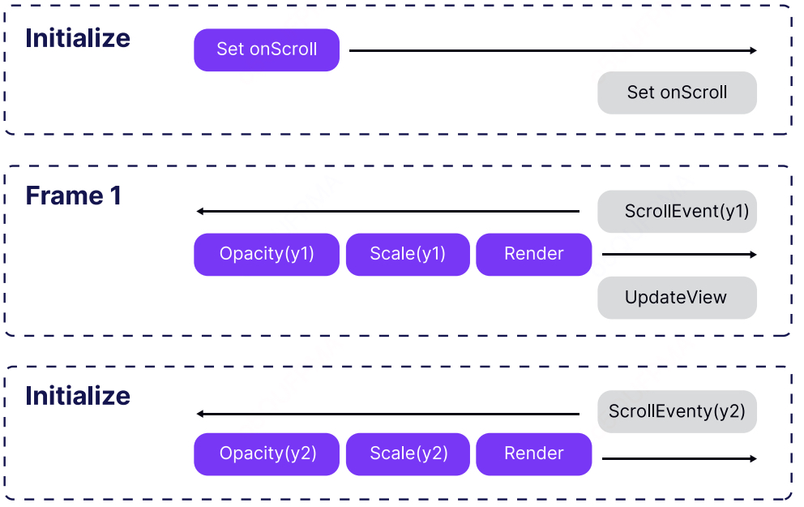

某些库（例如 Animated）提供了特殊的解决方法。在这种情况下，可以使用 NativeDriver，它会将动画序列化，并在动画开始时一次性传递给原生线程。在动画运行期间，不会通过桥接进行通信，从而避免了在执行其他任务时可能导致的帧丢失。

因此，保持桥接通信的高效和快速非常重要。

#### 桥接通信的流量越多，留给其他任务的空间就越少。

通过桥接传递更多流量意味着 React Native 在该时刻可用于传输其他重要内容的空间会减少。结果，您的应用在执行原生调用时，可能会对手势或其他交互变得不够响应。

如果您在通过桥接执行某些原生调用时，发现用户界面性能下降或 CPU 消耗显著增加，您应该仔细检查自己对外部库的使用情况。很可能传输的数据量超出了实际需要的范围。

### 解决方案：在 JavaScript 端使用适当的抽象层——提前验证和检查数据类型。

在构建原生模块时，直接将调用代理到原生端并让其完成其余操作是很诱人的做法。然而，在某些情况下（例如参数无效），可能会导致不必要的桥接往返调用，仅仅是为了发现我们提供的参数不正确。

以下是一个直接将调用代理到底层原生模块的 JavaScript 模块示例：

```javascript
import { NativeModules } from 'react-native';
const { ToastExample } = NativeModules;

export const show = (message, duration) => {
    ToastExample.show(message, duration);
};
```
如果参数不正确或缺失，原生模块很可能会抛出异常。当前版本的 React Native 并未提供一种抽象机制来确保 JavaScript 参数与原生代码所需的参数保持一致。

在这种情况下，调用会被序列化为 JSON，传递到原生端并执行。即使未传递完成所需的全部参数，该操作仍会开始。然而，当原生端处理调用并从原生模块接收到异常时，错误才会被捕获。

在这种场景中，您浪费了等待异常返回的时间，而这些问题本可以在调用之前就检查到。

```javascript
import { NativeModules } from 'react-native';
const { ToastExample } = NativeModules;

export const show = (message, duration) => {
    if (typeof message !== 'string' || message.length > 100) {
        throw new Error('Invalid Toast content');
    }

    if (!Number.isInteger(duration) || duration > 20000) {
        throw new Error('Invalid Toast duration');
    }

    ToastExample.show(message, duration);
};
```

上述问题不仅仅局限于原生模块本身。同样需要注意的是，每个 React Native 的原生组件都有其对应的原生实现，每次渲染发生时，组件的属性都会通过桥接传递——不过也不完全是这样。在组件重新渲染时并非总是如此。

React Native 的渲染器足够智能，它会对 JavaScript 端 React 组件层级进行“diff”操作，仅通过桥接传递必要的信息，以便更新原生视图层级。

例如，当使用 style 属性对组件（如 View 或 Text）进行样式设置时，仅变化的部分会被传递。以下是一个使用内联样式的示例：

```javascript
import React from 'react';
import { View } from 'react-native';
const App = () => {
    return (
        <View
            style={{
                flex: 1,
                justifyContent: 'center',
                alignItems: 'center',
            }}>
                <View
                style={{
                    backgroundColor: 'coral',
                    width: 200,
                    height: 200,
                }}
                />
        </View>
    );
};
export default App;
```

即使 style 属性以内联对象的形式传递，它也不会引发性能问题。无论是基于 props 动态更改样式，还是重新渲染 App 组件，都不会对性能造成影响。

View 会将其属性几乎直接传递给底层的原生表示。而得益于 React Native 渲染器的优化，无论我们在 JavaScript 端多频繁重新渲染该组件，只有更新 style 属性所需的最小数据量会通过桥接传递。这种机制有效保证了性能，同时减少了桥接通信的开销。

在 React Native 中，我们有更优雅的方式处理样式，那就是通过 StyleSheet API。它是一个类似于 CSS 样式表的专用抽象工具。尽管它在性能上没有优势，但它因开发和维护的便利性而值得一提。

当我们使用 TypeScript 或 Flow 开发应用时，StyleSheet 是类型化的，能够让代码编辑器提供自动补全功能。这种类型安全和自动补全的支持可以提升开发效率，并减少出错的可能性。

### 优势：代码库更高效且更易于维护

无论您当前是否面临性能挑战，围绕原生模块实施一套最佳实践始终是明智的选择，因为这不仅关乎速度，还直接影响用户体验。当然，保持适量的桥接通信流量最终将有助于您的应用性能更佳、运行更流畅。正如您所见，本节提到的某些技术已经在 React Native 内部被积极应用，为您提供开箱即用的令人满意的性能表现。了解这些技术将帮助您在高负载下创建性能更好的应用程序。

***然而，还有一个值得指出的额外优势：维护性。***

将复杂的抽象（如验证）保留在 JavaScript 层，将使原生层非常轻量，仅仅是对底层原生 SDK 的封装。换句话说，您的模块的原生部分将更像是从文档中复制粘贴过来的代码——直观且具体。

掌握这种开发原生模块的方法，是许多 JavaScript 开发者能够轻松为其应用扩展额外功能的原因，而无需精通 Objective-C 或 Java。

## 第六节 以 60FPS 动画效果运行——无论任何情况

> 使用原生解决方案实现流畅的动画和以手势驱动的界面，保持 60FPS。

### 问题：由 JS 驱动的动画占用了桥接流量，导致应用变慢。

移动端用户习惯了流畅且设计精良的界面，这些界面能够快速响应交互并提供及时的视觉反馈。因此，应用程序需要在多个地方注册大量动画，这些动画必须在其他工作同时进行时保持运行。

正如我们从上一节了解到的，桥接传递的信息量是有限的，当前并没有内置的优先队列。换句话说，如何设计和构建您的应用，使业务逻辑和动画能够同时无缝运行，这需要您提前规划。这与我们通常进行动画的方式有所不同。

例如，在 iOS 上，内置 API 提供了无与伦比的性能，并始终以适当的优先级进行调度。简单来说，我们无需过多担心动画是否能保持 60FPS 的流畅运行。

然而，在 React Native 中，情况稍有不同。如果您没有从顶层出发预先规划动画，并选择合适的工具来解决这一挑战，那么迟早会遇到掉帧的问题。

***卡顿或缓慢的动画会影响用户对应用的感知，使其看起来迟缓且不完善。***

在当今众多应用中，提供流畅且具有交互性的用户界面可能是吸引客户选择您的应用的唯一途径之一。

如果您的应用无法提供与用户交互（例如手势）良好配合的响应式界面，不仅可能影响新客户的体验，还会降低投资回报率（ROI）并削弱用户满意度。

移动用户喜欢紧随其互动的界面，这些界面应设计精良，而动画始终流畅运行是构建这种体验的基本要素之一。


### 解决方案：如果可能，使用原生且正确的动画。

> One-off animations
启用 native driver 是快速提升动画性能的最简单方法。然而，可以与 native driver 一起使用的样式属性集是有限的。

您可以使用 native driver 操作非布局属性，如 transforms 和 opacity。但它不支持操作诸如 colors、height 等属性。不过，这些支持的属性足以实现应用中大多数动画，因为通常情况下，您只需要显示/隐藏某些元素或更改其位置。

```javascript
const fadeAnim = useRef(new Animated.Value(0)).current;

const fadeIn = () => {
    Animated.timing(fadeAnim, {
        toValue: 1,
        duration: 1000,
        useNativeDriver: true, // enables native driver
    }).start();
};

// [...]

<Animated.View style={{ opacity: fadeAnim }} />
```

对于更复杂的用例，您可以使用 React Native Reanimated 库。它的 API 与基础的 Animated 库兼容，同时引入了一套基于现代 hooks 的接口，用于对动画进行更细粒度的控制。

更重要的是，Reanimated 提供了使用 native driver 动画所有可能的样式属性的能力。因此，动画 height 或 color 将不再是问题。不过，transform 和 opacity 动画仍会稍快一些，因为它们是通过 GPU 加速的。

您可以在 Reanimated Playground 中尝试不同的组合来测试动画效果和性能。

#### 手势驱动的动画
通过手势控制动画是动画效果中最理想的体验之一。对于用户来说，这部分交互最具吸引力，可以增强用户的满意度，并让应用显得更加流畅和响应迅速。

然而，原生的 React Native 在将手势与原生驱动动画相结合时功能较为有限。例如，可以利用 ScrollView 的滚动事件实现平滑的可折叠头部效果。但对于更复杂的用例，您可以借助一个强大的库——React Native Gesture Handler，它允许您原生处理不同的手势并将其与动画插值结合起来。通过与 Animated 配合，您可以构建可滑动的元素。

尽管这种方法仍需要使用 JavaScript 回调，但有一个解决方案！

最佳工具组合：Gesture Handler 和 Reanimated

React Native Gesture Handler 和 Reanimated 是处理手势驱动动画的最强大组合。它们被设计为无缝协作，能够在完全原生端计算复杂的手势驱动动画。

借助您的创意和 Reanimated 的强大功能，您可以以设备的最佳速度创建精彩的手势驱动动画。无论是滑动列表、复杂的交互式卡片，还是更高阶的手势动画，这套工具组合都可以满足需求，让您的应用拥有顶尖的用户体验。

```javascript
import React from 'react';
import { StyleSheet, View } from 'react-native';
import { PanGestureHandler } from 'react-native-gesture-handler';
import Animated, {
 useAnimatedGestureHandler,
 useAnimatedStyle,
 useSharedValue,
 withSpring,
} from 'react-native-reanimated';

const Snappable = (props) => {
    const startingPosition = 0;
    const x = useSharedValue(startingPosition);
    const y = useSharedValue(startingPosition);

    const animatedStyle = useAnimatedStyle(() => {
        return {
            transform: [{ translateX: x.value }, { translateY: y.value }],
        };
    });

    const eventHandler = useAnimatedGestureHandler({
        onStart: (event, ctx) => {
            ctx.startX = x.value;
            ctx.startY = y.value;
        },
        onActive: (event, ctx) => {
            x.value = ctx.startX + event.translationX;
            y.value = ctx.startY + event.translationY;
        },
        onEnd: (event, ctx) => {
            x.value = withSpring(startingPosition);
            y.value = withSpring(startingPosition);
        },
    });
    return (
        <PanGestureHandler onGestureEvent={eventHandler}>
            <Animated.View style={animatedStyle}>{props.children}</Animated.View>
        </PanGestureHandler>
    );
};

const Example = () => {
    return (
        <View style={styles.container}>
            <Snappable>
                <View style={styles.box} />
            </Snappable>
        </View>
    );
};

export default Example;
```

```javascript
const BOX_SIZE = 100;

const styles = StyleSheet.create({
    container: {
        flex: 1,
        justifyContent: 'center',
        alignItems: 'center',
        backgroundColor: '#F5FCFF',
    },
    box: {
        width: BOX_SIZE,
        height: BOX_SIZE,
        borderColor: '#F5FCFF',
        alignSelf: 'center',
        backgroundColor: 'plum',
        margin: BOX_SIZE / 2,
    },
});
```
低级别的手势处理可能并不容易，但幸运的是，有一些第三方库利用了上述工具，并提供了 callbackNode 属性。callbackNode 是一个由特定手势行为派生的 Animated.Value，其值范围通常为 0 到 1，表示手势的进度。您可以将这些值插值到屏幕上的动画元素中，从而实现动态效果。

一个很好的例子是以下库，它们暴露了 callbackNode：
	•	reanimated-bottom-sheet：用于创建动态的底部弹出框，支持手势驱动的展开和收起。
	•	react-native-tab-view：用于实现具有流畅切换效果的标签视图组件，可结合手势进行切换动画。

这些库简化了复杂的手势处理过程，让开发者能够轻松实现流畅的手势驱动动画。

```javascript
import * as React from 'react';
import { StyleSheet, Text, View } from 'react-native';
import Animated from 'react-native-reanimated';
import BottomSheet from 'reanimated-bottom-sheet';
import Lorem from './Lorem';

const { Value, interpolateNode: interpolate } = Animated;

const Example = () => {
    const gestureCallbackNode = new Value(0);

    const renderHeader = () => (
        <View style={styles.headerContainer}>
            <Text style={styles.headerTitle}>Drag me</Text>
        </View>
    );
    const renderInner = () => (
        <View style={styles.innerContainer}>
            <Animated.View
                style={{
                opacity: interpolate(gestureCallbackNode, {
                    inputRange: [0, 1],
                    outputRange: [1, 0],
                }),
                transform: [
                    {
                        translateY: interpolate(gestureCallbackNode, {
                            inputRange: [0, 1],
                            outputRange: [0, 100],
                            }),
                        },
                ],
                }}>
                <Lorem /> 
            </Animated.View>
        </View>
    );
    return (
    <View style={styles.container}>
        <BottomSheet
            callbackNode={gestureCallbackNode}
            snapPoints={[50, 400]}
            initialSnap={1}
            renderHeader={renderHeader}
            renderContent={renderInner}
        />
    </View>
    );
};
export default Example;

const styles = StyleSheet.create({
    container: {
     flex: 1,
    },
    headerContainer: {
        width: '100%',
        backgroundColor: 'lightgrey',
        height: 40,
        borderWidth: 2,
    },
    headerTitle: {
        textAlign: 'center',
        fontSize: 20,
        padding: 5,
    },
    innerContainer: {
      backgroundColor: 'lightblue',
    },
});
```

#### 为您的 JavaScript 操作设置较低的优先级

并非总能完全控制动画的实现方式。例如，React Navigation 使用了 React Native Gesture Handler 和 Animated 的组合，这种实现仍需要 JavaScript 来控制动画的运行时逻辑。因此，如果导航到的屏幕加载了一个复杂的 UI，可能会导致动画出现闪烁。

幸运的是，您可以使用 InteractionManager 来推迟这些繁重任务的执行。这一实用工具允许将耗时的工作安排在所有交互/动画完成之后。特别是，这种方法可以让 JavaScript 动画运行得更流畅。

***注意：在不久的将来，您将能够直接通过 React 自身的渲染器层（使用 Fabric）实现类似的行为，借助 startTransition API。有关更多信息，请参阅 New Architecture 章节。***


```javascript
import React, { useState, useRef } from 'react';
import {
 Text,
 View,
 StyleSheet,
 Button,
 Animated,
 InteractionManager,
 Platform,
} from 'react-native';
import Constants from 'expo-constants';

const ExpensiveTaskStates = {
 notStared: 'not started',
 scheduled: 'scheduled',
 done: 'done',
};

const App = () => {
    const animationValue = useRef(new Animated.Value(100));
    const [animationState, setAnimationState] = useState(false);
    const [expensiveTaskState, setExpensiveTaskState] = useState(
        ExpensiveTaskStates.notStared,
    );
    const startAnimationAndScheduleExpensiveTask = () => {
        Animated.timing(animationValue.current, {
            duration: 2000,
            toValue: animationState ? 100 : 300,
            useNativeDriver: false,
            }).start(() => {
            setAnimationState((prev) => !prev);
        });
        setExpensiveTaskState(ExpensiveTaskStates.scheduled);
        InteractionManager.runAfterInteractions(() => {
        setExpensiveTaskState(ExpensiveTaskStates.done);
        });
    };

    return (
        <View style={styles.container}>
            {Platform.OS === 'web' ? (
                    <Text style={styles.infoLabel}>
                    ❗InteractionManager works only on native platforms.
                    Open example on
                    iOS or Android❗
                    </Text>
                ) : (
                <>
                    <Button
                        title=''Start animation and schedule expensive
                        task''
                        onPress={startAnimationAndScheduleExpensiveTask}
                    />
                    <Animated.View
                     style={[styles.box, { width: animationValue. current }]}>
                        <Text>Animated box</Text>
                    </Animated.View>
                    <Text style={styles.paragraph}>
                        Expensive task status: {expensiveTaskState}
                    </Text>
                </>
            )}
        </View>
    );
};

const styles = StyleSheet.create({
    container: {
        flex: 1,
        justifyContent: 'center',
        alignItems: 'center',
        paddingTop: Constants.statusBarHeight,
        padding: 8,
    },
    paragraph: {
        margin: 24,
        fontSize: 18,
        textAlign: 'center',
    },
    box: {
        backgroundColor: 'coral',
        marginVertical: 20,
        height: 50,
    },
    infoLabel: {
        textAlign: 'center',
    },
});

export default App;
```

在实际应用中，您可以先显示一个占位符，等待动画完成后再渲染实际的 UI。这种方式可以让 JavaScript 动画运行得更加流畅，并避免其他操作对动画造成的中断。通常，这种方法足够平滑，可以提供出色的用户体验。

### 优势：享受流畅的动画效果和以手势驱动的界面，保持 60FPS 的性能表现。
在 React Native 中，没有一种统一的正确方式来实现动画。整个生态系统中有许多不同的库和方法可以用于处理交互。本节提出的建议只是一些推荐，希望鼓励您不要将流畅的界面视为理所当然的结果。

更重要的是，在头脑中构建应用程序中所有交互的全局图景，并选择合适的方法来处理这些交互。在某些情况下，JavaScript 驱动的动画完全能够满足需求。但同时，也有一些交互必须依赖原生动画（或完全的原生视图）才能实现流畅效果。

采用这样的思路，您创建的应用程序将更加流畅且响应迅速。这样的应用不仅会让用户使用起来感到愉悦，也会让您在开发和调试时充满乐趣。

#### 使用 Reanimated

使用 React Native Reanimated 的主要优势之一是，它能够直接在原生线程上执行动画，而不是依赖 JavaScript 线程。这种方式可以显著提高性能，尤其是在较旧或较慢的设备上，能够提供更流畅的动画效果。

在使用 React Native 提供的 Animated 时，您只能在原生线程上动画 transforms 和 opacity，其余属性需要在 JavaScript 线程上完成。这可能会导致动画卡顿和缓慢（如前文所述）。但在 Reanimated 中，您可以在原生线程上对所有样式属性进行动画操作，这极为强大。

以下是一个通过 Reanimated 动画操作多个样式属性的示例，包括 width、height、borderRadius、backgroundColor 和 borderColor，且不会丢帧：

```javascript
import * as React from 'react';
import { View, StyleSheet } from 'react-native';
import Constants from 'expo-constants';
import Animated, {
withRepeat,
withDelay,
withSequence,
withTiming,
interpolateColor,
interpolate,
useAnimatedStyle,
useSharedValue,
} from 'react-native-reanimated';
export default function App() {
// Define the shared animated value
const animatedValue = useSharedValue(0);
React.useEffect(() => {
// Start the animation
animatedValue.value = withRepeat(
withSequence(
withDelay(1000, withTiming(1)),
withDelay(1000, withTiming(0))
),
Infinity,
true
);
}, []);
const animatedStyle = useAnimatedStyle(() => {
return {
width: interpolate(animatedValue.value, [0, 1], [50,
100]),
height: interpolate(animatedValue.value, [0, 1], [50,
100]),
// from square to circle
borderRadius: interpolate(animatedValue.value, [0, 1],
[0, 50]),
backgroundColor: interpolateColor(
animatedValue.value,
[0, 1],
['gold', 'salmon']
),
borderColor: interpolateColor(
animatedValue.value,
[0, 1],
['purple', 'papayawhip']
),
borderWidth: 10,
};
}, [animatedValue.value]);
return (
<View style={styles.container}>
<Animated.View style={animatedStyle} />
</View>
);
}
const styles = StyleSheet.create({
container: {
flex: 1,
justifyContent: 'center',
alignItems: 'center',
paddingTop: Constants.statusBarHeight,
backgroundColor: '#333',
padding: 8,
},
});
```

Reanimated 为我们提供了许多基础工具，可以用来创建强大、复杂且高性能的动画。

#### Hooks 和方法

##### useSharedValue

共享值（Shared Values）可以存储数据，提供对变化作出反应的方式，驱动动画，最重要的是，它是响应式的。作为响应式的，意味着任何使用该共享值的地方都能实时接收更新。
数据存储在 UI 线程上，但也可以从 JS 线程访问，因此被称为“共享值”。共享值可以是数字、布尔值、字符串、对象和数组。

```javascript
const anim = useSharedValue(number | string | boolean | object | array)
```

##### useDerivedValue
它是一个共享值，但用于从共享值中派生或创建新值。这在您希望抽象一些逻辑（例如插值、数学运算）或为了复用目的时非常有用。

```javascript
const newAnim = useDerivedValue(() => {
    return anim.value + 100;
}, [anim.value])
```

##### useAnimatedStyle
当样式属性需要基于共享值更新，或某个特定样式属性依赖于共享值时，可以使用它。此钩子返回的将是一个“响应式”的样式。

```javascript
const styles = useAnimatedStyle(() => ({
    opacity: anim.value,
    width: anim.value * 10
}, [anim.value])
```

##### useAnimatedProp
这是 useAnimatedStyle 的对应方法，但适用于非样式属性，例如 SVG 的路径、输入框的值等。

```javascript
const animatedProps = useAnimatedProps(() => ({
    path:`
        M 100,100
        A anim.value, anim.value 0,0,1 10, 20
        A anim.value, anim.value 0,0,1 10, 20
        Q 90,60 50,90
        Q 10,60 10,30 z
    `,
})
```

##### interpolate
此方法允许您将值从一个输入范围（inputRange）重新映射到一个输出范围（outputRange）。

```javascript
const styles = useAnimatedStyle(() => ({
    width: interpolate(
        anim.value // sharedValue
        [0, 1] // inputRange
        [0, 100] // outputRange
    )
}, [anim.value])
```

##### interpolateColor
与 interpolate 类似，但用于颜色，其中 outputRange 是一个包含颜色值的数组。

```javascript
const styles = useAnimatedStyle(() => ({
    color: interpolateColor(
        anim.value // sharedValue
        [0, 1] // inputRange
        [“red”, “blue”] // outputRange
    )
}, [anim.value])
```

##### Timing functions
我们可以使用计时函数来为共享值设置动画。您可以使用 withTiming、withSpring 或 withDecay。您还可以通过 withDelay、withRepeat 或 withSequence 来修改这些计时函数的默认行为。最棒的是，您可以根据需要自由组合它们：

```javascript
anim.value = withRepeat(
    withSequence(
        withDelay(1000, withTiming(1)
        withDelay(1000, withTiming(0)
    )
    Infinity
    true
)
```
上面的代码将以初始延迟 1000 毫秒的方式重复反向一个动画序列。

##### UI Primitives
为了使 UI 元素对上述变化做出响应，需要注意，只有 Animated 元素才会执行动画。Reanimated 导出了以下 UI 基础组件：

```javascript
import Animated from 'react-native-reanimated'

<Animated.View />
<Animated.Text />
<Animated.Image />
<Animated.ScrollView />
<Animated.FlatList />
```
以及一个名为 createAnimatedComponent 的方法，它可以将任何 UI 基础组件/组件变为 Animated 组件。以下是一个示例，我们将把 TextInput 转换为一个 Animated 组件，使其能够对共享值的变化做出响应：

```javascript
import Animated from 'react-native-reanimated'
import { TextInput } from 'react-native'
const AnimatedTextInput = Animated.
createAnimatedComponent(TextInput)
```

如果在 useAnimatedStyle 或 useAnimatedProp 中存在重复逻辑，可以将其提取到 useDerivedValue 中，并在内部使用返回的值。以下是一个示例：

```javascript
const animatedStyle = useAnimatedStyle(() => {
    return {
        width: interpolate(animatedValue.value, [0, 1], [50, 100]),
        height: interpolate(animatedValue.value, [0, 1], [50,
        100]),
        transform: [{
            translateX: interpolate(animatedValue.value, [0, 1], [50,
        100])
        }]
    };
}, [animatedValue.value]);
```
我们可以看到，对于 width、height 和 transform.translateX 使用了相同的插值逻辑和相同的 outputRange，因此可以将其提取到一个派生值（derived value）中：

```javascript
const interpolatedValue = useDerivedValue(() => {
    return interpolate(animatedValue.value, [0, 1], [50, 100])
}, [animatedValue.value]);

const animatedStyle = useAnimatedStyle(() => {
    return {
        width: interpolatedValue.value,
        height: interpolatedValue.value,
        transform: [{
            translateX: interpolatedValue.value
        }]
    };
}, [interpolatedValue.value]);
```
通过这种方式，我们对代码进行了抽象和复用，减少了出错的可能性，并且性能更高，因为 interpolatedValue 只会被计算一次。

#### 尽可能多地使用插值（Interpolations）。
出于性能考虑，避免一次性动画过多的共享值非常重要。例如，与其为每个样式属性创建一个 sharedValue 并分别应用 withTiming 函数，不如使用单个 sharedValue 并通过插值来实现动画。这样不仅可以提高代码性能，减少错误，更重要的是，您的动画将由一个共享值协调管理，未来也更容易更改。

以下是一个组件的起始示例，注意每个样式属性都定义了一个共享值。当组件挂载时，我们为所有 5 个共享值（width、height、borderRadius、backgroundColor 和 translateY）启动动画，并传递不同的值：
```javascript
function MyComponent() {
const width = useSharedValue(50);
const height = useSharedValue(50);
const borderRadius = useSharedValue(0);
const backgroundColor = useSharedValue(0);
const translateY = useSharedValue(0);

React.useEffect(() => {
    width.value = withTiming(100);
    height.value = withTiming(100);
    borderRadius.value = withTiming(50);
    backgroundColor.value = withTiming(1);
    translateY.value = withTiming(50)
}, [])

const animatedStyle = useAnimatedStyle(() => {
    return {
        width: width.value,
        height: height.value,
        borderRadius: borderRadius.value,
        backgroundColor: interpolateColor(
            backgroundColor.value,
            [0, 1],
            ['gold', 'salmon']
        ),
        transform: [{
            translateY: translateY.value
        }]
    };
});

return <Animated.View style={animatedStyle} />
}
```
正如您可能想象的那样，添加另一个样式属性会增加代码的复杂性和维护难度，这并不好。相反，我们可以使用单个共享值，并根据需要对其进行插值。以下是使用单个共享值重写上述组件的方式：
```javascript
function MyComponent() {
    // Define the shared animated value
    const animatedValue = useSharedValue(0);
    React.useEffect(() => {
        // Start the animation
        animatedValue.value = withTiming(1);
    }, []);

    const animatedStyle = useAnimatedStyle(() => {
        return {
            width: interpolate(animatedValue.value, [0, 1], [50, 100]),
            height: interpolate(animatedValue.value, [0, 1], [50, 100]),
            borderRadius: interpolate(animatedValue.value, [0, 1], [0, 50]),
            backgroundColor: interpolateColor(
                animatedValue.value,
                [0, 1],
                ['gold', 'salmon']
            ),
            transform: [{
                translateY: interpolate(animatedValue.value, [0, 1],
                [0, 50])
            }]
            };
        }, [animatedValue.value]);

    return <Animated.View style={animatedStyle} />
}
```
#### 使用 SharedValues 替代 setState 或 useRef

我们可以利用 SharedValue 存储不同的状态，而不会触发状态变化。以下是一个示例，我们将创建一个 useLayout 钩子，用于将组件的布局值存储到 SharedValue 中。

```javascript
export const useLayout = () => {
    const layout = useSharedValue<LayoutRectangle>({
        x: 0,
        y: 0,
        width: 0,
        height: 0,
    });

    const onLayout = useCallback<(event: LayoutChangeEvent) => void> ((e) => {
        const {
            nativeEvent: {
            layout: { height, width, x, y },
            },
        } = e;
        layout.value = { height, width, x, y };
    }, []);
    return {
        layout,
        onLayout,
    };
};
```
## 第七节 用 Rive 替代 Lottie

> 利用状态机提供强大且流畅的交互动画，保持 60FPS 性能

### 问题：实时动画因低帧率、文件大小过大以及不够健壮而受到影响
当我们谈到交互式移动应用时，往往会想到用户驱动的动画。例如，在完成结账时，可以展示一个漂亮的下单成功动画。一个更复杂的例子是引导步骤（onboarding），用户需要点击各种按钮才能继续前进，大多数情况下，每个步骤都会显示一个精美的动画。那么，开发者如何实现这种行为呢？

一种方法是使用 GIF。如果我们有 3 个引导步骤，那么我们可能需要准备 3 个 GIF。这种解决方案在性能和用户体验（UX）方面通常已经足够。然而，如果我们需要更高的动画保真度，或者需要高质量的全屏动画时，GIF 会显得不足。GIF 文件可能会迅速为应用的包大小增加几兆字节。

那么，还有哪些替代选项呢？这时可以讨论 Lottie。Lottie 是一个适用于 Android 和 iOS 的移动端库，由 Airbnb 的开发者创建，用于利用 LottieFiles。LottieFiles 是基于 JSON 的动画文件，可以通过 Adobe AfterEffects 的 BodyMoving 插件导出。Lottie 拥有一个非常活跃的社区，其中包含许多免费的动画资源。您可以访问 LottieFiles 查看。

在 React Native 中，Lottie 库非常受欢迎，并且获得了社区的广泛好评。通过 progress 属性可以控制动画进度，也可以使用命令式方法（如 play）来控制动画。此外，还有许多实用的属性可以根据需求自定义动画行为。

接下来，我们对比一下 Lottie JSON 动画 和对应的 GIF 动画 的文件大小。

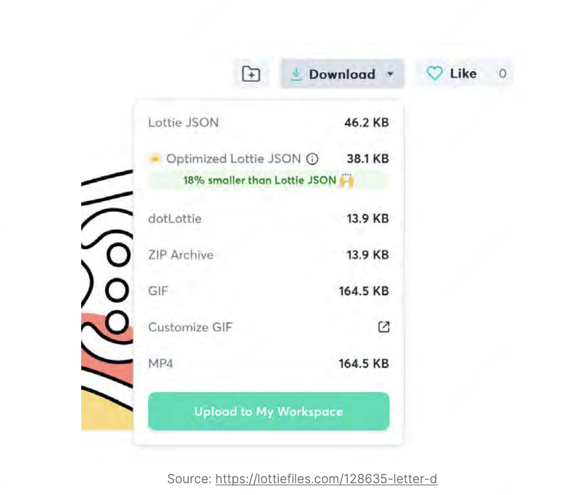

如果进行对比，JSON 动画文件大小为 46.2 KB，而对应的 GIF 文件大小为 164.5 KB，几乎是 JSON 的 4 倍。我们还可以通过使用 Optimized Lottie JSON 进一步减少 JSON 的大小，但这是一项付费解决方案。回想之前提到的为每个引导步骤使用单独 GIF 的方法，现在我们可以改用 Lottie，因为它的文件更小。

此外，我们可以使用远程资源的 Lottie JSON 文件，而不是将其打包在应用中。不过，为了离线使用，我们需要额外的工作来确保其可用性。

但是，我们可以进一步优化。如果使用一个单独的动画，并通过触发器控制它的状态会怎么样？例如，点击按钮后，动画的状态改变以显示下一步骤。

假设我们希望更改动画的大小或做其他自定义调整，这在 LottieFiles 提供的编辑器中无法完成。相反，我们必须将文件导入到 Adobe AfterEffects（AE） 中，进行调整后重新导出为 JSON。当然，我们可以在 LottieFiles 的 Web 编辑器中自定义层的颜色。

然而，并不是所有人都有使用 Adobe AE 的专业技能，也未必都有动画师可以咨询。比如，如果我们在开发自己的个人项目，我们更希望能够直接在 Web 编辑器中调整动画，而不需要依赖专业工具。

关于 Lottie 的性能还有其他相关因素，我们将在下一节中讨论。

### 解决方案：利用开发者友好的工具，实现更高的 FPS 和更小的文件大小。

有一个新工具叫 Rive，它旨在成为 Lottie 的替代方案，不仅提供 Lottie 的所有功能，还带来了更多特性。Rive 提供一个 Web 编辑器，可实时自定义动画。该编辑器允许用户创建交互式动画，这些动画能够根据用户提供的输入进行交互。基于触发器的动画在移动平台上是一大优势。

还记得我们为引导步骤动画采用的方法吗？现在，如果我们使用 Rive 动画，可以利用其状态机、触发器和用户输入功能，通过一个动画文件完成引导步骤的所有动画。这极大地改善了开发者体验，更重要的是：Rive 动画文件的大小比 Lottie JSON 小得多。此外，不需要为每个引导步骤保留不同的文件，从而为应用包节省了不少 KB 的大小。

```javascript
import React, { useRef } from 'react';
import { Button, SafeAreaView, StyleSheet } from 'reactnative';
import Rive, { RiveRef } from 'rive-react-native';
const stateMachineOne = 'State Machine 1';
const App = () => {
 const riveRef = useRef<RiveRef>(null);
 const isRunning = useRef(false);
 const onIsRunning = () => {
 isRunning.current = !isRunning.current;
 riveRef.current?.setInputState(
 stateMachineOne,
 'isRunning',
 isRunning.current,
 );
 };
 const onSideKick = () => {
 riveRef.current?.fireState(stateMachineOne, 'sideKick');
 };
 return (
 <SafeAreaView>
 <Rive
 ref={riveRef}
 resourceName=''character''
 style={styles.character}
 stateMachineName={stateMachineOne}
 autoplay
 />
 <Button title=''Is Running'' onPress={onIsRunning} />
 <Button title=''SideKick'' onPress={onSideKick}
color=''#3e3e3e'' />
 </SafeAreaView>
 );
};
export default App;
const styles = StyleSheet.create({
 character: {
 width: 400,
 height: 400,
 },
});
```

如我们所见，添加复杂动画对开发者非常友好。我们还可以快速添加基于触发器或输入的动画。我们所需要的只是有关状态机、输入和触发器的信息。如果我们有一位动画师在 Rive Editor 上为项目制作了一个精美的动画，我们可以请他们提供相关信息。否则，我们也可以自行在 Web 编辑器中查找这些信息。

现在，让我们从 FPS、CPU 和内存消耗的角度讨论性能。我们将对比为 Lottie 创建的动画与同样为 Rive 创建的动画。此推文显示了针对 Web 平台的基准测试。我们会扩展这一比较，将同样的动画用于我们的 React Native 应用进行测试。

##### Lottie

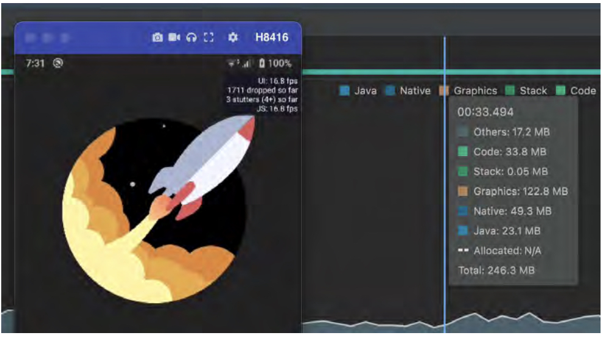

##### Rive

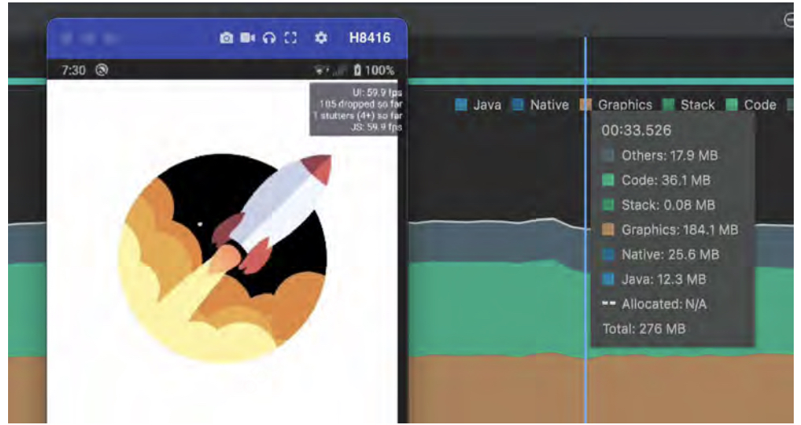

我们在 Sony Xperia Z3 设备上使用 Android Profiler 和 React Native 应用内置的 Perf Monitor 进行了基准测试。为了避免开发模式（DEV mode）导致 JS 线程的节流，我们禁用了开发模式。

两张图片显示了火箭上方的小窗口，其中包含 UI 线程和 JS 线程的 FPS 详细信息。结果显示，Rive 动画几乎能以 60FPS 运行，而 Lottie 动画只能达到 17FPS。

接下来关注图片右侧的内存消耗详细视图。可以看到主要分为以下三个部分：
1.	Java：分配给 Java 或 Kotlin 代码的内存。
2.	Native：分配给 C 或 C++ 代码的内存。
3.	Graphics：用于图形缓冲区队列以在屏幕上显示像素的内存。

具体内存消耗对比如下：
- Java：Lottie 使用约 23 MB，Rive 使用约 12 MB。
- Native：Lottie 使用约 49 MB，Rive 使用约 25 MB。
- Graphics：Lottie 使用约 123 MB，Rive 使用约 184 MB。

总内存消耗：
- Lottie：246 MB
- Rive：276 MB


结果显示，Rive 在除 Graphics 之外的所有方面都优于 Lottie。终端用户希望应用能够以 60FPS 运行，以享受流畅的用户体验。如果必须在内存消耗和 FPS 之间进行权衡，大多数情况下会选择 FPS，因为大部分设备的内存都足以满足应用的需求。

### 优势：缩短功能开发过程中的回归周期，提升用户满意度。

如果我们选择一个没有状态机的世界，开发者需要在代码中实现动画逻辑。每次动画的交互性发生变化，开发者都需要重新修改代码。这并不是一个好的开发者体验。

Rive 的状态机 让设计师可以像编写代码一样思考，并为动画设计和组织状态机，这些动画在接收到特定输入后会作出交互反应。开发者只需使用该动画并触发相应的输入即可完成交互的实现。如果需要更改动画，只需更换动画源文件，而无需修改任何代码逻辑。更多信息可以参考相关文档。

约 18.7% 的用户因为存储问题而卸载应用，这会损害公司的投资回报率（ROI）。开发者应始终关注减少应用的包大小和存储使用量。在 Rive 的 CEO 发布的一条推文中提到，相同的动画，Lottie 文件约 24.37 KB，而 Rive 文件仅约 2 KB。

总的来说，每节省的 1 KB 都有助于减小应用的大小。我们始终希望选择一个既能提供更好的开发者体验、更易用的 API，又能为终端用户带来流畅体验的库。

## 第八节 使用 Skia 在画布上高效绘制

### 问题：使用传统方法难以实现核心应用设计理念

PO 或设计团队可能对产品设计有着不妥协的愿景，或者设想了一些难以通过 Rive 或 React Native Reanimated 在不牺牲性能或跨平台兼容性的情况下实现的特定功能。也许这是为了跟随某种设计趋势？也许应用将会包含大量图表，或者拥有一个图形丰富的仪表板？又或者计划打造一个具有高性能且美观的图像过渡效果的界面？

例如，组件阴影的渲染方式在 iOS 和 Android 上有所不同；在 Android 上，遮罩（Masking）可能运行较慢；模糊效果在 Android 上的支持也有限。此外，尽管 Rive 是一个易用且高性能的工具，但它也有一些限制，例如对模糊、发光、阴影和路径效果的支持有限。

当遇到此类问题时，您可能已经在脑海中构想了希望在应用中呈现的确切画面。而对于这样精准的需求，您将需要一个能够提供最大渲染管线控制的工具。

### 解决方案：或许是时候尝试使用 Skia 了

Skia 是一个开源的 2D 图形库，提供跨多种硬件和软件平台通用的 API。它是 Google Chrome 和 ChromeOS、Android、Flutter、Mozilla Firefox 及 Firefox OS 等众多产品的图形引擎。

得益于 Shopify，React Native 开发者可以通过 @shopify/react-native-skia 库使用声明式的 Skia 绘图功能。通过这个库，我们可以完全控制渲染，甚至精确到像素。它是一种强大的工具，可以以优秀的性能覆盖几乎任何场景。

**React Native Skia** 的 API 使用 `<Canvas />` 元素，该元素是应用视图树中的最后一个“原生”元素，同时作为 Skia 绘图的根节点。所有放入其中的 react-native-skia 子组件都将作为该库的声明式 API 使用。在底层，它使用自己的 React 渲染器进行工作。

以下是一个使用 `@shopify/react-native-skia` 的示例，它在固定大小的 Canvas 上渲染了两个圆，并将它们混合在一起：

```javascript
import React from ''react'';
import { useWindowDimensions } from 'react-native';
import { Canvas, Circle, Group, vec } from '@shopifyreactnative-skia';

const App = () => {
    const {width, height} = useWindowDimensions();
    const c = vec(width / 2, height / 2);
    const r = width * 0.33;
    return (
        <Canvas style={{ width, height }}>
            <Group blendMode='multiply'>
                <Circle cx={r} cy={c.y} r={r} color='cyan' />
                <Circle cx={width - r} cy={c.y} r={r} color='magenta' />
            </Group>
        </Canvas>
    );
};
```
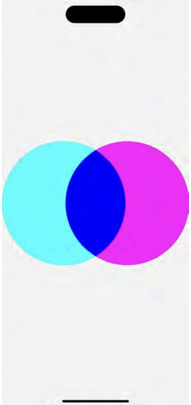

从这个示例中，我们还可以看到 API 的核心元素之一——<Group /> 组件。<Group /> 可以进行深度嵌套，并对其子元素应用以下操作：
- 绘图属性 (Paint properties) - 类似于 SVG，应用于 Group 的属性（如样式、颜色）将被子元素继承。
- 变换 (Transformations) - 类似于 React Native 的 transform 属性，但有一个显著区别：在 React Native 中，变换的原点是对象的中心；而在 Skia 中，变换的原点是对象的左上角。
- 裁剪 (Clipping) - clip 属性定义了子元素显示的区域，超出该区域的部分将被隐藏。通过 invertClip 属性可以反转裁剪区域。
- 位图效果 (Bitmap effects) - layer 属性会创建子元素的位图绘制。例如，您可以使用此功能为一组元素构建需要应用的效果。

为了让其中一个圆形移动，我们可以使用 Reanimated 与 Skia 配合实现动画效果。以下是一个示例：

```javascript
import React from ''react'';
import { useWindowDimensions } from 'react-native';
import { Canvas, Circle, Group, vec } from ''@shopify/reactnative-skia'';
import {
Easing,
 cancelAnimation,
 useSharedValue,
 withRepeat,
 withTiming,
} from ''react-native-reanimated'';
export const useLoop = ({ duration }) => {
const progress = useSharedValue(0);
 useEffect(() => {
 progress.value = withRepeat(
 withTiming(1, { duration, easing: Easing.inOut(Easing.
ease) }),
 -1,
true
 );
return () => {
 cancelAnimation(progress);
 };
 }, [duration, progress]);
return progress;
};
const App = () => {
const ANIMATION_OFFSET = 50;
const {width, height} = useWindowDimensions();
const c = vec(width / 2, height / 2);
const r = width * 0.33;
const progress = useLoop({duration: 2000});
const circleTranslate = useDerivedValue(
 () => mix(progress.value, c.y + ANIMATION_OFFSET, c.y -
ANIMATION_OFFSET),
 [progress],
 );
return (
 <Canvas style={{ width, height }}>
 <Group>
 <Circle cx={r} cy={c.y} r={r} color=''cyan'' />
 <Circle cx={width - r} cy={circleTranslate} r={r}
color=''magenta'' />
 </Group>
 </Canvas>
 );
};
```

正如您可能注意到的，React Native Skia 可以直接接受 Reanimated 的值作为属性，这使得画布绘图与动画的集成变得无缝，从而为用户带来令人愉悦的动态体验。

需要特别注意的是，<Canvas /> 默认是透明的，这非常适合用作创建一些炫酷自定义组件的基础。在以下示例中，我们会在 <Canvas /> 下方添加一个带红色方块的 <View />。

```javascript
const App = () => {
const ANIMATION_OFFSET = 50;
const {width, height} = useWindowDimensions();
const c = vec(width / 2, height / 2);
const r = width * 0.33;
const progress = useLoop({duration: 2000});
const circleTranslate = useDerivedValue(
 () => mix(progress.value, c.y + ANIMATION_OFFSET, c.y -
ANIMATION_OFFSET),
 [progress],
 );
return (
 <>
 <View
 style={{
 alignItems: 'center',
 justifyContent: 'center',
 ...StyleSheet.absoluteFill,
 }}>
 <View style={{height: 300, width: 300,
backgroundColor: 'red'}} />
 </View>
 <Canvas style={{flex: 1}}>
  <Group>
 <Circle cx={r} cy={c.y} r={r} color=''cyan'' />
 <Circle cx={width - r} cy={circleTranslate} r={r}
color=''magenta'' />
 </Group>
 </Canvas>
 </>
 );
};
```

需要记住的是，如果您使用 <Canvas /> 来应用某种效果，而该效果需要影响底层的图层，这些更改只会应用到 <Canvas /> 内的元素。例如，像 <Shadow /> 这样的效果会被正确渲染，但 <Blur /> 只会处理画布内部的元素。

如果需要模糊底层图层，您需要捕获该图层的快照。为此，可以使用 makeImageFromView 函数。该函数接收您想捕获快照的 <View /> 的引用，并返回一个包含图像数据的 Promise，您可以将该图像用作 <Canvas /> 的图层进行变换。

以下是一个添加模糊卡片的示例。在组件中，您会看到模糊效果只会作用于圆形，而之前示例中的红色方块仍然是清晰的。为了修复这个问题，我们将捕获底层视图的快照并将其作为 <Canvas /> 中的图像引用。

```javascript
const pd = PixelRatio.get();
const App = () => {
const {width, height} = useWindowDimensions();
const c = vec(width / 2, height / 2);
const r = width * 0.33;
const CARD_WIDTH = width - 60;
const CARD_HEIGHT = CARD_WIDTH * 0.5;
const ANIMATION_OFFSET = 50;
const clip = useMemo(
 () => rrect(rect(0, 0, CARD_WIDTH, CARD_HEIGHT), 20, 20),
 [CARD_HEIGHT, CARD_WIDTH],
 );
const ref = useRef<View>(null);
const progress = useLoop({duration: 2000});
const x = useSharedValue((width - CARD_WIDTH) / 2);
const y = useSharedValue((height - CARD_HEIGHT) / 2);
const transform = useDerivedValue(() => [
 {translateY: y.value},
 {translateX: x.value},
 ]);
const circleTranslate = useDerivedValue(
 () => mix(progress.value, c.y + ANIMATION_OFFSET, c.y -
ANIMATION_OFFSET),
 [progress],
 );
const [image, setImage] = useState<SkImage | null>(null);
 useEffect(() => {
 makeImageFromView(ref).then(snapshot =>
setImage(snapshot));
 }, []);
return (
 <>
 <View
 ref={ref}
 collapsable={false}
 style={{
 alignItems: 'center',
 justifyContent: 'center',
 ...StyleSheet.absoluteFill,
 }}>
 <View style={{height: 300, width: 300,
backgroundColor: 'red'}} />
 </View>
 <Canvas style={{flex: 1}}>
 <Image
image={image}
x={0}
y={0}
height={(image?.height() || 0) / pd}
width={(image?.width() || 0) / pd}
/>
 <Group>
 <Circle cx={r} cy={c.y} r={r} color=''cyan'' />
 <Circle cx={width - r} cy={circleTranslate} r={r}
color=''magenta'' />
</Group>
 <BackdropBlur blur={20} transform={transform}
clip={clip}>
 <Fill color=''rgba(0, 0, 0, 0.3)'' />
 </BackdropBlur>
 </Canvas>
 </>
 );
};
```


这种方法可以帮助您在主应用内容之上创建外观优美的跨平台叠加效果，但需要提前规划，因为您需要对底层视图设置引用（ref）。

React Native Skia 的另一个强大功能是路径插值（path interpolation）。由于计算是在原生端通过 C++ 执行的，因此速度极快，不会阻塞 JS 线程，从而确保 UI 对用户操作保持响应。

在这个简单示例中，我们将使用 d3 库生成两个基于数据的曲线路径，然后在画布上渲染它们，并实现它们之间的动画切换。

```javascript
import React, {useEffect} from 'react';
import {useSharedValue, withRepeat, withTiming} from 'reactnative-reanimated';
import {
Skia,
 usePathInterpolation,
Canvas,
Path,
} from '@shopify/react-native-skia';
import {curveBasis, line, scaleLinear, scaleTime} from 'd3';
const GRAPH_HEIGHT = 500;
const GRAPH_WIDTH = 350;
export const data1 = [
 {date: '2023-12-01T00:00:00.000Z', value: 110},
…
 {date: '2023-12-15T00:00:00.000Z', value: 700},
];
export const data2 = [
 {date: '2023-12-01T00:00:00.000Z', value: 700},
…
 {date: '2023-12-15T00:00:00.000Z', value: 400},
];
const makeGraph = data => {
const max = Math.max(...data.map(val => val.value));
const y = scaleLinear().domain([0, max]).range([GRAPH_
HEIGHT, 35]);
const x = scaleTime()
 .domain([new Date(2023, 12, 1), new Date(2023, 12, 15)])
 .range([10, GRAPH_WIDTH - 10]);
const curvedPath = line()
 .x(d => x(new Date(d.date)))
 .y(d => y(d.value))
 .curve(curveBasis)(data);
return Skia.Path.MakeFromSVGString(curvedPath!);
};
const App = () => {
const progress = useSharedValue(0);
const graphData = [makeGraph(data1), makeGraph(data2)];
 useEffect(() => {
 progress.value = withRepeat(withTiming(1, {duration:1000}), -1, true);
 }, [progress]);
const path = usePathInterpolation(
 progress,
 [0, 1],
 [graphData[0], graphData[1]],
 );
return (
 <Canvas style={{flex: 1}}>
 <Path
 path={path}
 style=''stroke''
 strokeWidth={5}
 strokeCap=''round''
 strokeJoin=''round''
 />
 </Canvas>
 );
};

```


usePathInterpolation 钩子负责在切换图形时正确插值路径值。为了让动画看起来平滑，路径必须是可插值的，并且需要包含相同数量和类型的命令，否则可能导致插值效果异常，甚至导致应用崩溃。

### 优势：获得强大的工具，帮助您创建独特且高性能的用户界面
接近原生的性能、高度的可定制性以及出色的 API，如果您的目标是创建既创新又快速的用户界面，这些将对您大有帮助。再加上与当前工具（如 react-native-gesture-handler 和 react-native-reanimated）的良好集成，当新的 UI 设计趋势出现时，您将拥有一个非常出色的工具。

我们这里只讨论了 react-native-skia 功能的一小部分。像图像处理滤镜、遮罩、富文本渲染以及强大的着色器等功能，都不在本指南的范围之内。

了解更多关于 React Native Skia 及其可能应用的最佳途径是查看以下资源：
- 官方文档
- William Candillon 的 YouTube 频道
- Daniel Friyia 的 YouTube 频道

## 第九节 优化您的应用 JavaScript 包

### 问题：React Native 默认的 JS 打包工具 Metro 生成的包体积过大。

React Native 应用程序的大部分逻辑都位于运行在 JavaScript 引擎（如 JavaScriptCore 或 Hermes）中的 JavaScript 代码中。但在将 JavaScript 代码加载到应用之前，需要先将其打包，通常打包为一个单独的 JS 文件，有时也会拆分为多个文件。React Native 提供了一个用于 JavaScript 代码打包的内置工具，名为 Metro。

### 解决方案：使用外部插件或替换为第三方打包工具

像其他打包工具一样，Metro 接收一个入口文件和各种选项，返回一个包含所有代码及其依赖项的单个 JavaScript 文件，也就是所谓的 JavaScript bundle。

根据官方文档，Metro 通过本地缓存转换后的模块来加速构建。Metro 优先考虑性能而不是可配置性，而其他打包工具（如 Webpack）则恰恰相反。因此，当您的项目需要自定义加载器或使用 Webpack 的广泛配置功能来打包 JavaScript 代码并拆分应用逻辑时，可以选择一些适用于 React Native 应用的替代打包工具，这些工具提供了更多的配置选项。

不过，每种工具都有各自的优势和局限性。

##### [Re.Pack](https://re-pack.netlify.app/)

Re.Pack 是一个基于 Webpack 的工具包，用于构建 React Native 应用程序。它完全支持 Webpack 生态系统，包括加载器、插件以及符号链接（symlinks）、别名（aliases）、代码拆分（code splitting）等功能。Re.Pack 是 Haul 的继任者，尽管两者在权衡不同性能需求和开发者体验方面有所不同，但目标一致。

Webpack 的生态系统对于许多开发者来说至关重要，因为它是目前最流行的 Web 打包工具，加载器和插件背后的强大社区是其主要优势。由于其高度的可插拔性，Webpack 提供了改进构建流程和整体性能的方法，至少在与内部模块图构建和处理无关的部分。例如：
- JavaScript 和 TypeScript 的转译（transpilation）。
- 代码压缩（minification）。

您可以通过加载器替换默认工具以提升性能，例如：
- 使用 esbuild-loader 替换 Babel 转译器和 Terser 压缩工具。
- 使用 swc-loader 替代 Babel 或其他工具。

Webpack 的另一个功能是通过 Tree Shaking 减少最终打包代码的体积，从而提高应用性能。Tree Shaking 是一种死代码消除技术，它通过分析源码中的 import 和 export 语句，确定应用实际使用的代码。然后，Webpack 会从最终打包文件中移除所有未使用的代码，从而生成更小、更高效的应用。

要实现 Tree Shaking，代码需要满足以下条件：
- 使用 ECMAScript 模块（即 import 和 export 语句）编写。
- 在 package.json 文件中通过 sideEffects: false 声明代码无副作用，确保 Webpack 可以安全地移除未使用的代码。

Webpack 支持符号链接（symlinks），但从 React Native 0.72 开始，Metro 也以实验形式提供了对符号链接的支持。从 v0.73 开始，该功能默认启用。符号链接在 monorepo 中非常有用，因为它可以在不同的工作空间之间高效地共享 node_modules，从而优化依赖管理和构建流程。

Re.Pack 提供了使用异步代码块（asynchronous chunks）的功能，可以将应用的打包文件拆分为多个文件，并根据需要按需加载。如果您使用的是 JavaScriptCore 引擎，这种方式可以显著改善应用的初始加载时间。

然而，当与 Hermes 引擎一起使用时，这种优化的效果可能不那么显著，因为 Hermes 使用内存映射技术（memory mapping），可以直接从 RAM 动态读取字节码中所需的部分。这种拆分可能会对目标是低端 Android 设备、且打包文件非常大的应用产生一定的积极影响。

但这里还有一个更有趣的点！Webpack 并不在意动态代码块是从文件系统中加载还是从远程加载。因此，它允许动态加载一开始并未包含在应用打包文件中的代码——可以直接从远程服务器或 CDN 获取。

这种方式不仅可以进一步减少应用的初始加载时间，还能显著减小应用的安装包大小。此外，它还为仅针对应用某些部分的 OTA（Over-The-Air）更新 提供了可能性，从而更加高效地管理和发布更新。

除此之外，Webpack 5 引入了对 模块联邦（Module Federation） 概念的支持。这一功能允许对代码进行分块（code-splitting），并在独立的应用程序之间共享这些分块（或代码块）。

模块联邦还帮助分布式和独立团队更快地交付大型应用程序。它赋予团队选择任意 UI 框架的自由，并可以独立部署，同时仍然使用相同的构建基础设施。

Re.Pack 3 开箱即支持这一功能，并提供了许多在这些场景中非常有用的工具。例如，CodeSigningPlugin 可以帮助您验证远程加载代码包的完整性，确保代码的安全性和可靠性。

所有这些配置和灵活性都会对构建过程产生影响。由于支持更多的自定义选项，Re.Pack 的构建速度会比默认的 Metro 打包工具稍慢。

从 Metro 切换到 Re.Pack 时，可能需要解决一些解析错误，因为这两种打包工具使用的算法不同。此外，与 Metro 相比，快速刷新（Fast Refresh） 功能存在一定限制。在使用 Webpack 和 Re.Pack 时，热模块替换（HMR） 和 React Refresh 功能有时可能需要重新加载整个应用程序。

在使用 模块联邦（Module Federation） 时，HMR 功能仅限于刷新来自主机的部分应用程序代码，而对于远程模块，则需要进行完整重载。

如果您不需要 Webpack 生态系统提供的大量自定义功能，或者不计划拆分应用程序代码，那么您完全可以继续使用默认的 Metro 打包工具。

##### [react-native-esbuild](https://github.com/oblador/react-native-esbuild)

react-native-esbuild 的主要优势之一是其构建速度非常快。它在底层使用 ESBuild 作为打包工具，即使没有缓存，也能显著提升打包性能。它还提供了一些功能，例如 Tree Shaking，并且相比于 Metro 打包工具，它的可配置性更强。ESBuild 拥有自己的生态系统，包括插件、自定义转换器和环境变量支持。该加载器默认启用于 .ts、.tsx、.mts 和 .cts 文件，这意味着 ESBuild 内置支持解析 TypeScript 语法，并能够移除类型注解。然而，ESBuild 不进行任何类型检查，因此您仍需要在 ESBuild 运行的同时单独进行类型检查。这部分工作需要额外的工具完成，而不是 ESBuild 自身的功能。

不幸的是，react-native-esbuild 存在一些权衡点，因此在选择打包工具时，关注这些限制也非常重要。

不支持 Hermes：Hermes 是 React Native 的默认 JavaScript 引擎，而 react-native-esbuild 无法与其兼容。没有快速刷新（Fast Refresh）或热模块替换（Hot Module Replacement）：与 Metro 的功能相比，这些特性缺失。然而，该库支持 实时重载（Live Reload） 作为替代方案。

##### [rnx-kit](https://microsoft.github.io/rnx-kit/)

微软的 rnx-kit 是 Metro 的一个有趣扩展。它是一个包含大量 React Native 开发工具的包。从历史上看，它在 Metro 官方支持之前，就实现了对符号链接的支持。与 Metro 相比，另一个好处是通过使用 ESBuild 进行打包，可以开箱即用地提供 tree shaking 功能。

Metro 支持 TypeScript 源文件，但它仅将其转译为 JavaScript。Metro 不执行任何类型检查。而 rnx-kit 解决了这个问题。通过配置，您可以启用类型检查。TypeScript 的警告和错误会显示在控制台中。

此外，rnx-kit 提供了对重复依赖和循环依赖的开箱即用检测。这对于减少包的大小、提升性能以及防止循环依赖问题非常有用。请注意，您需要自己解决这些问题，但幸运的是，rnx-kit 的文档提供了有关如何处理它们的一些见解。

### 优势：向用户交付更少的 JavaScript。节省开发者打包时间。

打包工具的选择取决于具体情况。不可能为所有应用程序选择唯一的打包工具。

正如您所看到的，在 React Native 中可以通过使用 Webpack（通过 Re.Pack）或 ESBuild（通过 rnx-kit 或 react-native-esbuild）实现 Tree Shaking。不同打包工具对 Tree Shaking 的实现方式有所不同，因此检查两者的结果并确定最适合您的应用是可行的。需要注意的是，通过 rnx-kit 实现的 Tree Shaking 仍处于测试阶段，但目前的结果相当乐观。通常可以预期包大小的差异在 0% 到 20% 之间，在少数情况下甚至可能超过这一范围。

如果您需要 Webpack 生态系统提供的自定义选项，或者计划拆分应用程序代码，那么我们建议使用 Re.Pack，因为它拥有高度可定制的配置、大量社区维护的加载器和插件。如果您觉得 Webpack 生态系统过于复杂，那么最好继续使用默认的 Metro 打包工具，或者尝试其他打包工具选项，如 react-native-esbuild 和 rnx-kit，它们还提供了一些优势，例如减少构建时间（底层使用 esbuild）、支持符号链接（symlinks）以及开箱即用的 TypeScript 支持。但请注意，在采用新的打包系统时，始终要关注其带来的权衡点。

